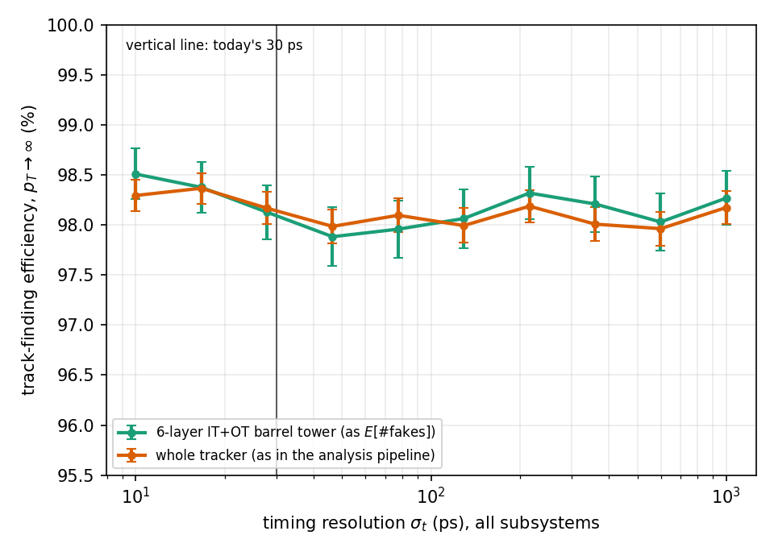
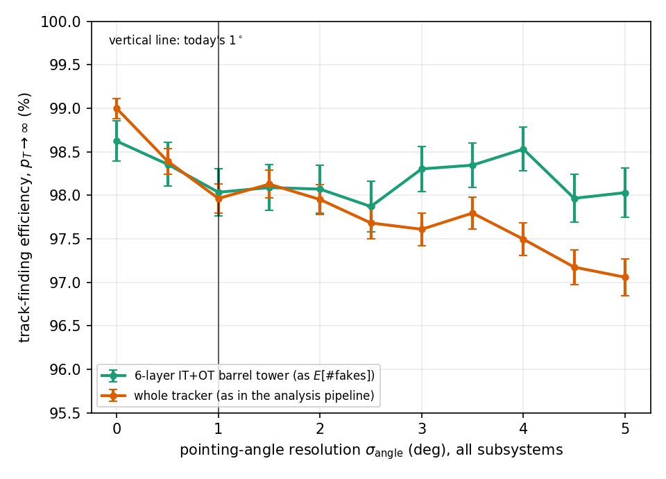

**For discussion. Sections marked [DRAFT] are rough and meant to be revised; numbers are final (taken directly from the simulation) but the surrounding prose is not.**

*Scope note: the core of this draft (Sections 1–9) covers straight-line (zero magnetic field) tracks, in the flat-plane, barrel-style geometry of Section 2 (itself a faithful, non-idealized model of real stave-built barrel trackers, not a simplification of a curved surface). Section 10 extends the method to the large-transverse-momentum (small-curvature) regime with a uniform axial magnetic field, for the physically important case of tracks originating on the beam axis — showing that the same linear-fit machinery applies there too, with one view of the track picking up a curvature term and the other staying linear. The fully general curved-track case (arbitrary impact parameter, no large-$p_T$ restriction) is more involved and is left for further work.*

---

## 1. Introduction and goal [DRAFT]

A tracking detector made of $N$ discrete measurement planes reconstructs charged-particle trajectories by fitting a track model to one hit per plane. In any real event, in addition to hits belonging to genuine particle trajectories, planes also register uncorrelated noise hits (electronic noise, out-of-time activity, unrelated low-energy activity, etc.). A combination of $N$ such noise hits, one per plane, will in general fit poorly to the track model and be rejected by a quality (chi-square) cut. However, purely by chance, some noise combinations will fit well enough to pass the cut and be mistaken for a real track — a "fake" track.

The goal of this note is to develop, and validate by direct Monte Carlo simulation, a method for estimating the **expected number of fake tracks** produced by random noise-hit combinations in a given detector configuration, as a function of:

- the detector geometry (number of planes, their size, their position, and their measurement resolution),
- the noise hit density on each plane,
- the chi-square cut (and any additional cuts on the fitted track parameters, such as an angular acceptance) used to accept a track candidate.

Most of this note (Sections 1–9) uses the simplest track model: a straight line in 3D, appropriate for a detector with no magnetic field (or, more generally, wherever the track curvature can be neglected). Section 10 extends the method to a uniform axial magnetic field in the large-transverse-momentum limit, for tracks originating on the beam axis; the fully general curved-track case is left for further work.

A direct brute-force calculation — generate random hit combinations and count how many pass the cut — is in general computationally infeasible, because the interesting regime (a realistic detector, a resolution far smaller than the detector size, a cut tight enough to reject the overwhelming majority of noise combinations) corresponds to per-combination probabilities as small as $10^{-20}$–$10^{-50}$ or smaller. Reaching such probabilities by direct sampling would require an equally astronomical number of trials. Sections 2–4 develop an alternative: an analytic characterization of the relevant probability distribution, calibrated by Monte Carlo at a computationally tractable scale and then rescaled — exactly, not approximately — to the true detector. Section 3.5 discusses how this approach relates to established methods in the wider statistics and high-energy-physics literature.

---

## 2. Detector model and track fit [DRAFT]

### 2.1 Geometry

We adopt a typical collider configuration throughout, and keep it fixed for the rest of this note: the beam runs along a fixed axis $Z$. The detector consists of $N$ measurement planes, indexed $i=1,\dots,N$, each a flat slab perpendicular to a transverse axis $Y$ (the "depth" direction — in a real barrel tracker, close to the radial direction) and extending in the two remaining directions, $X$ (the other transverse direction) and $Z$ (along the beam). Plane $i$ sits at depth $Y_i$ and has:

- an active area of size $W_{X,i}\times W_{Z,i}$, spanning $X$ and $Z$,
- independent measurement resolutions $\sigma_{X,i}$, $\sigma_{Z,i}$ in $X$ and $Z$.

Plane sizes and resolutions may differ from plane to plane; nothing in what follows requires the planes to be identical (see Section 5.2).

This is a direct, non-idealized model of how real barrel silicon trackers are actually built: a cylindrical barrel layer is not a curved surface but a ring of flat staves or ladders, each one exactly the kind of flat slab modeled here. So the flat-plane geometry is not an approximation being made for tractability — it is what the detector looks like. The one piece of physics this note does not yet include is track curvature (from a magnetic field); that extension is the subject of a follow-up.

A noise hit on plane $i$ is modeled as a point drawn uniformly at random over the plane's active area, independently for each plane and each hit.

### 2.2 Track model and fit

For a straight, field-free trajectory, parametrized by depth $Y$,
$$X(Y) = a + bY, \qquad Z(Y) = c + dY,$$
four free parameters in total. Given one hit $(X_i,Z_i)$ per plane, $X(Y)$ and $Z(Y)$ are fit independently by weighted least squares, with weights $1/\sigma_{X,i}^2$ and $1/\sigma_{Z,i}^2$ respectively. The fit minimizes
$$\chi^2 = \sum_i \frac{[X_i - (a+bY_i)]^2}{\sigma_{X,i}^2} + \sum_i \frac{[Z_i - (c+dY_i)]^2}{\sigma_{Z,i}^2},$$
with $\mathrm{ndof} = 2N-4$ (two measured coordinates per plane, four fitted parameters).

A candidate combination is accepted as a track if $\chi^2 < \chi^2_\mathrm{cut}$ (and, optionally, if the fitted parameters satisfy an additional acceptance requirement — an angular cut, Section 5.3, or a beam-proximity cut expressed via the impact parameter, Section 5.4).

---

## 3. Probability that one random combination passes the cut [DRAFT]

### 3.1 Why direct simulation is not enough

For a detector where the resolution is far smaller than the plane size ($\sigma \ll W$), a single random hit combination essentially never resembles a real track: the $\chi^2$ of a random combination is dominated by the ratio $(W/\sigma)^2$, which for realistic detectors is $\gtrsim 10^4$–$10^8$. Section 7.1 shows this explicitly: for $N=8$ planes of $1000\times1000$ mm with $\sigma=10\ \mu$m, the median $\chi^2$ of a random combination is of order $10^{10}$, roughly nine orders of magnitude above the $\mathrm{ndof}=12$ expected for a genuine track. The quantity of interest, $P(\chi^2 < \chi^2_\mathrm{cut})$ for some reasonable cut (of order $\mathrm{ndof}$), lives correspondingly far in the tail of the distribution — far enough that direct Monte Carlo would need on the order of $10^{16}$–$10^{50}$ trials to populate it, which is not feasible.

### 3.2 Analytic tail behavior: a power law

The resolution to this is an analytic argument for the *shape* of $P(\chi^2<\mathrm{cut})$ in the small-$\mathrm{cut}$ (deep-tail) regime, which needs to be calibrated only in normalization, not in shape, by simulation.

The key fact is a symmetry: $\chi^2$ is exactly invariant under simultaneously adding any common polynomial correction $p+qY$ to every hit's $X$-coordinate (and independently $r+sY$ to every $Z$-coordinate), because such a shift is exactly absorbable into the fit parameters $(a,b)$ (resp. $(c,d)$) without changing the residuals. This four-parameter "gauge" freedom (matching the four fit parameters) can be fixed by choosing two "anchor" planes (e.g. the first and last) to define the line; the $\chi^2$ then depends only on the *relative* positions of the remaining $N-2$ planes' hits with respect to that line — an $\mathrm{ndof}$-dimensional space of residuals whose density is, to leading order, locally flat near $\chi^2=0$ (there is no special structure that would favor $\chi^2$ being exactly zero over infinitesimally nearby values). A standard small-volume argument then gives, for small $\mathrm{cut}$,
$$P(\chi^2 < \mathrm{cut}) \;\simeq\; K \cdot \mathrm{cut}^{\,\mathrm{ndof}/2},$$
a clean power law, with $K$ a normalization that depends on the detector geometry but not on $\mathrm{cut}$.

### 3.3 Calibrating $K$: the small-detector trick

Even the *normalization* $K$ cannot generally be measured directly at the true detector scale (that runs into the same intractable-probability problem). Instead we exploit an **exact scaling law**: for planes of uniform resolution $\sigma$, the weighted fit reduces to ordinary least squares, and OLS residuals are an exactly linear function of the input coordinate data. Consequently, rescaling every hit's transverse coordinate by a common factor $\lambda$ (holding $Y$ and $\sigma$ fixed) rescales $\chi^2$ by exactly $\lambda^2$. Equivalently, the dimensionless ratio
$$\frac{\chi^2}{(W/\sigma)^2}$$
has a distribution that is *exactly* independent of $W$ and $\sigma$ individually (given a fixed pattern of $Y$-spacings) — not merely approximately, but as an algebraic identity. This was verified numerically to sub-percent precision across several independent geometries and random seeds (Section 7.2).

This law lets us shrink an intractable detector (say $W=1000$ mm, $\sigma=10\ \mu$m) down to a small, computationally tractable one with the same $Y$-spacing pattern and the same $\sigma$, but with $W$ reduced until $W/\sigma$ is a modest number (in practice we used $W/\sigma\approx 10$), run a large but feasible Monte Carlo there (order $10^8$ trials), and rescale the result back to the true detector via $\chi^2_\mathrm{true} = \lambda^2\,\chi^2_\mathrm{shrunk}$, i.e.
$$P_\mathrm{true}(\chi^2<\mathrm{cut}) = P_\mathrm{shrunk}\!\left(\chi^2 < \mathrm{cut}/\lambda^2\right) = K\left(\frac{\mathrm{cut}}{\lambda^2}\right)^{\mathrm{ndof}/2}.$$

Importantly, this rescaling is a lossless bookkeeping identity by itself: it does not, on its own, reduce the amount of Monte Carlo work needed to characterize the deep tail of the *universal* dimensionless distribution. What actually makes the problem tractable is that shrinking the detector moves the fixed, physically-relevant cut $\chi^2_\mathrm{cut}$ from being buried tens of orders of magnitude into the unreachable tail of the true detector's chi-square distribution (whose typical scale is set by $(W/\sigma)^2$) to sitting only a few orders of magnitude below the *shrunk* detector's own directly-observable range — close enough that the analytic power law of Section 3.2, calibrated on genuinely observed statistics, can be extrapolated the short remaining distance with no loss of rigor. Section 3.5 discusses the relation of this two-step strategy (exact rescaling plus asymptotic tail extrapolation) to established techniques elsewhere in statistics and in high-energy physics.

### 3.4 Fixing the exponent, extracting $K$

The exponent $\mathrm{ndof}/2$ predicted in Section 3.2 was checked against a free power-law fit to the simulated deep tail; the free fit's exponent came out close to but not exactly equal to the prediction, which was traced to the fit window not extending deep enough into the true asymptotic regime rather than to any flaw in the prediction (Section 7.1). Fixing the exponent at its theoretical value and computing the *local* implied normalization
$$K_\mathrm{local}(\mathrm{cut}) \equiv \frac{P_\mathrm{empirical}(\chi^2<\mathrm{cut})}{\mathrm{cut}^{\,\mathrm{ndof}/2}}$$
across the available simulated range shows a clean, statistically consistent plateau at small $\mathrm{cut}$, with deviations appearing only once $\mathrm{cut}$ is no longer small compared to $\mathrm{ndof}$ — exactly as expected for an asymptotic small-$\mathrm{cut}$ power law. The plateau value is taken as $K$. Its deepest, sparsest bins carry the largest statistical uncertainty; this was verified with an independent 25-replica study to be ordinary Poisson scatter, not a systematic effect (Section 7.1).

### 3.5 Relation to existing methods [DRAFT]

The strategy used above — replace direct sampling of an intractably small probability with (i) an asymptotic or exact closed form for the tail's *shape*, calibrated against directly observable statistics, plus (ii) an exact transformation relating that calibration to the true target regime — is not unique to this problem. We did not set out to apply a named technique from the literature; the method emerged from first-principles reasoning about this specific detector combinatorics problem. In retrospect, though, it is a recognizable combination of two established methodological threads, and a third, closely analogous one within particle physics itself.

**Extreme Value Theory / Peaks-Over-Threshold.** Estimating the probability of events far more extreme than anything in a finite sample is a well-studied problem in statistics, most developed in finance, insurance, and hydrology (e.g. 100-year flood levels, portfolio tail risk). The Pickands–Balkema–de Haan theorem (Balkema & de Haan 1974; Pickands 1975) shows that, under general conditions, the distribution of exceedances above a sufficiently high threshold converges to a Generalized Pareto shape; standard practice (the Peaks-Over-Threshold, or POT, method) is to fit that asymptotic shape on the most extreme *observed* data and extrapolate to quantiles beyond the sample. Our small-cut power law $P(\chi^2<\mathrm{cut})\sim K\,\mathrm{cut}^{\mathrm{ndof}/2}$ plays exactly the role of that asymptotic tail shape, with the added convenience that its exponent is fixed analytically (Section 3.2) rather than fit, leaving only the normalization $K$ to calibrate on the deepest reliably-populated Monte Carlo bins (Section 3.4) — the same logical structure as POT, specialized to a case where the tail shape is known in closed form rather than only asymptotically Pareto.

**Asymptotic significance formulae in high-energy physics.** The same intractability — needing probabilities (p-values) far too small to estimate from a feasible number of toy Monte Carlo pseudo-experiments — arises routinely in particle-physics discovery statistics, e.g. establishing a $5\sigma$ significance. Cowan, Cranmer, Gross & Vitells (2011) derive analytic asymptotic formulae for the distribution of the profile-likelihood-ratio test statistic, replacing toy-MC estimation of tiny p-values with closed-form evaluation validated on directly achievable statistics; a closely related literature addresses the "look-elsewhere effect" (Gross & Vitells 2010) for the same underlying reason. The motivation and structure — derive or verify an asymptotic formula precisely because direct simulation of the target probability is computationally impossible — is the closest published analogue we are aware of within HEP itself, even though the concrete formulas differ (their result concerns likelihood-ratio test-statistic asymptotics; ours concerns weighted-least-squares $\chi^2$ combinatorics).

**Dimensional scaling collapse.** The rescaling step of Section 3.3 — an exact reduction of a family of distributions depending on two physical parameters ($W$, $\sigma$) to a single universal curve in the dimensionless ratio $\chi^2/(W/\sigma)^2$ — is an instance of the general nondimensionalization / scaling-collapse technique used throughout physics, most familiar from finite-size scaling in the theory of critical phenomena (Fisher 1971; Cardy 1996), where simulating small, tractable system sizes and rescaling is the standard route to properties of systems too large to simulate directly. Unlike finite-size scaling, where the collapse is itself only asymptotic (valid near a critical point, with corrections), our scaling law is an *exact* algebraic identity, a direct consequence of the linearity of weighted least squares in the input data (Section 3.3) — a comparatively rare case where this kind of rescaling trick costs nothing in exactness.

We record this correspondence because we believe the two-step strategy — exact or asymptotic tail-shape extrapolation, combined with an exact rescaling when one is available — is likely to be useful beyond this specific application, wherever a combinatorial or pattern-recognition acceptance probability must be evaluated at cuts far more stringent than direct simulation can reach.

### 3.6 Choosing $\lambda$ in practice: is there an optimal shrink factor? [DRAFT]

Section 3.3 leaves open a practical question: given a true detector geometry, how should one actually choose the shrink factor $\lambda$ (equivalently, the shrunk ratio $W_\mathrm{shrunk}/\sigma$) before running the calibration Monte Carlo? It is worth being precise about what this choice does and does not affect, since the two turn out to be quite different in character.

**Statistically, the choice does not matter — at all, once it is "enough."** Because $\chi^2/(W/\sigma)^2=s$ is an *exact*, universal identity (Section 3.3), the depth into the tail of $s$ that $N$ Monte Carlo trials can reach is completely independent of the physical $W/\sigma$ ratio chosen for the simulation: the deepest order statistics of $s$ obtained from $N$ trials are, up to Monte Carlo noise, the *same* regardless of $\lambda$. We verified this directly: running the same detector shape at $W/\sigma=10,\,100,\,10^4,\,10^6$ (six decades), same trial count and random seed, the raw $\chi^2$ values spanned twelve orders of magnitude, but the deepest reachable points expressed in $s$ agreed to five significant figures across all four ratios. Consequently, shrinking further than needed to calibrate $K$ to a target precision buys nothing: it does not let one see deeper into the tail, and it does not reduce the number of trials required. There is, in this sense, no optimization problem to solve for $\lambda$ — any $\lambda$ that lands in a sane practical range works equally well statistically, and pushing $\lambda$ larger "for safety" is not a meaningful hedge.

**What the choice of $\lambda$ *does* affect is entirely practical**, and this is where a genuine "sweet spot" lives:

- *Legibility.* A shrunk detector with $W_\mathrm{shrunk}/\sigma$ of order 5–20 produces typical (bulk, not tail) random-combination $\chi^2$ values in the tens-to-hundreds range — directly comparable by eye to the real-track expectation $\chi^2\sim\mathrm{ndof}$, and letting one literally see the "confusion region" where fake and real tracks overlap (the original motivation for shrinking at all, Section 7.1). This is a real, practical benefit, but it is about human interpretability of intermediate numbers, not about the correctness or reach of the final result.
- *Numerical precision.* One might expect that avoiding an astronomically large $W/\sigma$ ratio protects against floating-point error (e.g. cancellation in the weighted least-squares sums). We checked this directly rather than assumed it: computing $\chi^2$ at $W/\sigma=10^8$ (beyond the true detector's actual ratio) in ordinary double precision versus extended precision (80-bit `long double`) gave agreement to $10^{-15}$–$10^{-16}$ — double precision's own native limit — with no detectable degradation. The reason is structural: the fitted intercept and slope stay the same order of magnitude as the input hit positions, so the residual (data minus fit) is a difference of *comparable*-sized numbers, not a difference of huge weight-scaled sums; only a few digits are lost to the subtraction, far short of double precision's budget. For this fit, at these scales, precision simply is not the constraint one might naively assume it to be. We flag this as a *checked* fact for this specific fit structure, not a general guarantee: a higher-order polynomial fit, a more extreme dynamic range, or a differently-conditioned normal-equations matrix could behave differently, so when adopting this method for a new fit structure it is worth repeating the same extended-precision cross-check (a cheap, one-off comparison) rather than assuming it will hold.
- *A soft lower bound, not a correctness one.* Shrinking so far that $W_\mathrm{shrunk}$ becomes comparable to or smaller than $\sigma$ (ratio approaching or below 1 — a "plane narrower than its own resolution") is an unintuitive regime for a human to reason about, but not, as far as we have tested, an incorrect one: the exact scaling law was verified numerically down to $W/\sigma=0.3$ with no sign of departure from exactness, and the power-law tail behavior is a property of the universal distribution $s$ alone (Section 3.2), so it is automatically unaffected by which $W/\sigma$ one chose to generate the calibration sample. The caution here is about clarity, not validity.
- *An extreme lower bound, not reached in this work.* At a sufficiently large $\lambda$, floating-point underflow (values below double precision's smallest representable magnitude, $\sim 10^{-308}$) could in principle occur; this is many tens of orders of magnitude beyond anything used here and is noted only for completeness.

**Practical rule of thumb.** Choose $\lambda$ so that the smallest plane's shrunk width is roughly $5\sigma$–$20\sigma$: large enough to stay comfortably clear of the $W\sim\sigma$ regime and keep the geometry easy to reason about by eye, small enough that a standard-sized Monte Carlo run ($10^7$–$10^8$ trials) directly populates $\chi^2$ values of order a few $\times\,\mathrm{ndof}$, so the calibration's plausibility can be checked visually against the known real-track expectation before trusting the extrapolated tail. This is the range used throughout Sections 6–7 ($W_\mathrm{shrunk}/\sigma\approx 10$–$60$ for the projective tower). Precision should be spot-checked, not assumed, whenever the fit's structure, polynomial degree, or dynamic range departs materially from what has been validated here.

---

## 4. From one combination to the expected number of fakes [DRAFT]

Given $n_i$ noise hits on plane $i$ ($i=1,\dots,N$), the number of distinct hit combinations (one hit per plane) is $\prod_i n_i$. By linearity of expectation — an *exact* identity requiring no assumption of rare events or independence beyond the per-combination probability itself —
$$E[\#\text{fakes}] = \left(\prod_i n_i\right)\, P(\chi^2 < \mathrm{cut} \;[\text{and any other acceptance cuts}]).$$

Combined with Section 3, this gives a complete recipe: calibrate $K$ once (Section 3.3–3.4) for a given detector shape, then evaluate $E[\#\text{fakes}]$ for any hit density and any cut with no further simulation.

An immediate corollary: if every plane's hit density is scaled by a common factor $\mu$ (e.g. modeling a higher- or lower-occupancy running condition), $E[\#\text{fakes}]$ scales as $\mu^N$ — an extremely steep dependence, since $N$ is the number of planes.

### 4.1 A caveat: combinations are correlated, but the mean is exact regardless [DRAFT]

Different hit combinations are not statistically independent: two combinations that happen to share the same hit on some plane (which almost all pairs of combinations do, for realistic $n_i$) have correlated $\chi^2$ values, since both fits depend on that shared coordinate. It is natural to worry that this correlation invalidates the identity of Section 4, which sums $\chi^2$-cut indicator variables over all $\prod_i n_i$ combinations.

It does not, and the reason is worth stating explicitly because it is easy to conflate with a different, genuine effect. Linearity of expectation,
$$E\!\left[\sum_c \mathbb{1}(c \text{ passes})\right] = \sum_c E[\mathbb{1}(c \text{ passes})] = \sum_c P(c \text{ passes}),$$
where $\mathbb{1}(\cdot)$ is the indicator function (equal to 1 if the combination $c$ passes the cut, 0 otherwise, so that $E[\mathbb{1}(c\text{ passes})]=P(c\text{ passes})$), holds for *any* joint distribution of the indicator variables — correlated or independent, it makes no difference. Since every combination has the same marginal probability by symmetry, the sum collapses to $\left(\prod_i n_i\right) P(\text{single combination passes})$ exactly, with no independence assumption anywhere in the derivation.

What the correlation *does* affect is everything beyond the mean: the variance of the total fake count, and whether that count is well-approximated as Poisson-distributed. We verified this directly on a small, exhaustively-enumerable geometry ($N=4$ planes, 3 hits/plane, 81 combinations/event, so every combination — and every correlation between them — is computed exactly, not sampled): across 300,000 independent simulated events, the empirical mean number of passing combinations per event matched the predicted $n_\mathrm{combos}\times P_\mathrm{single}$ to within 1% (well inside statistical error), confirming the mean formula is exact as claimed. The empirical *variance*, however, came out $2.4\times$ the naive independent/Poisson prediction (variance $=$ mean) — clear evidence of positive correlation (shared hits make combinations "pass together" more than chance would predict), affecting the spread of the fake count but not its expectation.

Practically: every number reported in this note is $E[\#\text{fakes}]$, for which the correlation is irrelevant — the formula is exact as written throughout. Where the correlation would matter is if one instead wanted the *probability that at least one fake track appears* in a given event, or the *fluctuation size* around the mean count. The bound $P(\ge 1\text{ fake}) \le E[\#\text{fakes}]$ (Markov's/Boole's inequality) remains rigorously valid regardless of correlation, so a small $E[\#\text{fakes}]$ is still a valid guarantee against fakes; but the usual rare-event approximation $P(\ge 1\text{ fake})\approx E[\#\text{fakes}]$, which implicitly assumes near-independence, would be less tight here, since the true distribution is more "clumped" (weight shifted toward zero fakes and toward several-at-once) than a Poisson of the same mean.

---

## 5. Scaling laws and additional acceptance cuts [DRAFT]

This section collects the exact (or numerically verified) scaling relations that make the method practical beyond a single fixed geometry, together with three closed-form acceptance cuts commonly imposed in a real analysis.

### 5.1 Resolution scaling

From the universal scaling law of Section 3.3, at fixed cut and fixed plane size $W$,
$$P(\chi^2<\mathrm{cut}) \propto \sigma^{\,\mathrm{ndof}},$$
an extremely strong dependence on resolution. A factor-of-10 improvement in $\sigma$ suppresses the per-combination fake probability by $10^{\mathrm{ndof}}$ — for example $10^{-8}$ for $\mathrm{ndof}=8$ — which translates into being able to tolerate roughly $10^{\mathrm{ndof}/N}$ times more hits per plane before fakes become a concern (Section 7.4).

### 5.2 Non-uniform plane sizes and resolutions: a single whitened coordinate

The scaling law of Section 3.3 was derived assuming identical planes. It survives immediately, in a generalized form, for planes with **different sizes but a common resolution** $\sigma$: scaling every plane's width by the same factor $\lambda$ (holding the true, common $\sigma$ fixed) still scales $\chi^2$ by exactly $\lambda^2$, since the underlying algebraic fact — OLS residuals are linear in the input coordinates — does not depend on the design matrix having a particular structure beyond linearity. This is what allows the method to be applied to realistic, non-uniform geometries such as a "projective tower" of planes of increasing size (Section 7.4).

The general case — resolution $\sigma_i$ also varying from plane to plane — reduces to exactly this already-solved case, with no new derivation needed, by working throughout in **whitened coordinates**: define, for every plane and every measured axis,
$$X_i' \equiv \frac{X_i}{\sigma_{X,i}}, \qquad Z_i' \equiv \frac{Z_i}{\sigma_{Z,i}}.$$
The $\chi^2$ sum becomes, term by term, an *unweighted* sum of squared residuals in the primed coordinates, $\chi^2=\sum_i (X_i'-a/\sigma_{X,i}-bY_i/\sigma_{X,i})^2 + (\text{same for }Z)$ — the fit parameters $a,b,c,d$ keep exactly their original physical meaning, since whitening is pure bookkeeping on the coordinate used to express the residual, not a change to the fit itself. In this frame, a noise hit's whitened position is uniform over $\pm W_{X,i}'/2$ with $W_{X,i}'\equiv W_{X,i}/\sigma_{X,i}$, and with *unit* effective resolution on every plane. That is precisely the "non-uniform widths, common resolution" case above: one calibration ($K$, fixed power $\mathrm{ndof}/2$) for the fixed shape $\{w_i'=W_i'/W_\mathrm{ref}'\}$, one shrink factor $\lambda$ applied to all the $W_i'$ together, and the same universal single-ratio collapse in $\chi^2/(W'/1)^2=\chi^2/W'^2$.

So there is no separate "non-uniform sigma" case to treat: any detector with per-plane resolutions and sizes is, after this one substitution, a detector with per-plane sizes and unit resolution — already covered. We adopt whitened coordinates as the default going forward; the earlier restriction to a single common $\sigma$ was a simplification of exposition, not a limitation of the method. (The one requirement underlying the local-flat-density argument of Section 3.2, $\sigma_i\ll W_i$ on every individual plane, is unchanged by whitening — it becomes $W_i'\gg 1$.)

### 5.3 Angular-acceptance cut

Real analyses typically also restrict the fitted track's slope to some physical acceptance (e.g. $|b|,|d| < \tan\theta_\mathrm{max}$, the two slopes measured with respect to the $Y$ axis). This factorizes **exactly** out of the $\chi^2$ probability:
$$P(\chi^2<\mathrm{cut} \text{ and } |b|<s_\mathrm{max} \text{ and } |d|<s_\mathrm{max}) = f(s_\mathrm{max})\cdot P(\chi^2<\mathrm{cut}),$$
with, per axis,
$$f_\mathrm{1-axis}(s_\mathrm{max}) = \frac{\Delta}{W}\left(2-\frac{\Delta}{W}\right), \qquad \Delta \equiv s_\mathrm{max}\,(Y_\mathrm{last}-Y_\mathrm{first}),$$
and $f(s_\mathrm{max}) = f_\mathrm{1-axis}(s_\mathrm{max})^2$ for a symmetric cut applied to both measured coordinates. The derivation follows the same anchor-gauge argument as Section 3.2: the *shape* of the $\chi^2$ tail is independent of where the two anchor hits happen to sit, so restricting the anchors' positions to a slope-compatible region only rescales an integration area, leaving the $\chi^2$ distribution itself untouched. This was confirmed numerically to hold independent of the chosen $\chi^2$ cut, as the formula predicts (Section 7.3). Because it is exact and free (no cost to a real track already within the angular acceptance), it should be included whenever applicable.

### 5.4 Beam-proximity cut I: requiring the track to pass through the origin

A stronger, related constraint is to require the fitted track to pass through a fixed point exactly — a vertex constraint, $X(Y{=}0)=Z(Y{=}0)=0$ — rather than merely bound its slope. This has only two free parameters instead of four ($X(Y)=bY$, $Z(Y)=dY$), and Section 9.1 uses exactly this reduced model as an independent sanity check of the whole framework. Here we instead ask the complementary question: for the *ordinary* four-parameter fit, what is the probability that the fitted track happens to pass close to the origin, i.e. $\sqrt{X(0)^2+Z(0)^2}<d_0^{\max}$ for some small tolerance $d_0^{\max}$?

Write $a\equiv X(Y{=}0)$, $c\equiv Z(Y{=}0)$ for the two fitted intercepts. Using the first and last planes as anchors, $a$ and $c$ are recovered by barycentric interpolation between the two anchor hits,
$$a = \alpha X_1 + \beta X_N, \qquad \alpha = \frac{Y_N}{Y_N-Y_1}, \quad \beta = \frac{-Y_1}{Y_N-Y_1}, \quad \alpha+\beta=1,$$
and likewise for $c$ from the anchor $Z$-hits. Since $X_1,X_N$ are independent uniforms, $a$ is a sum of two independent (generally differently-scaled) uniforms — a trapezoidal, or triangular in the special case $|\alpha|W_{X,1}=|\beta|W_{X,N}$, distribution — with density at the origin $f_a(0)=1/\max(|\alpha|W_{X,1},\,|\beta|W_{X,N})$, and likewise $f_c(0)$ for $c$. Since $a$ (from the $X$-anchor hits) and $c$ (from the independent $Z$-anchor hits) are themselves independent, a standard disk-area argument gives, for small $d_0^{\max}$,
$$g(d_0^{\max}) \;\equiv\; P\!\left(\sqrt{a^2+c^2}<d_0^{\max}\right) \;\approx\; \pi\,(d_0^{\max})^2\, f_a(0)\, f_c(0),$$
a **quadratic** small-cut law (rather than the linear law of the slope cut), since it constrains a 2D region rather than a 1D interval. As with the slope cut, the factorization $P(\chi^2<\mathrm{cut}\text{ and }d_0<d_0^{\max}) = g(d_0^{\max})\cdot P(\chi^2<\mathrm{cut})$ is **exact**, not just a small-$d_0^{\max}$ approximation, by the same anchor-gauge argument: restricting the anchor pair's positions only rescales the integration area over that pair, leaving the $\chi^2$ tail shape — governed by the other $N-2$ planes — untouched.

This was verified numerically on a six-plane projective-tower geometry (uniform-resolution anchors giving $f_a(0)=f_c(0)=0.833\ \mathrm{mm}^{-1}$ by construction): the quadratic-law ratio $g_\mathrm{empirical}(d_0^{\max})/[\pi (d_0^{\max})^2 f_a(0) f_c(0)]$ converges to 1 (within Monte Carlo noise, from 0.988 to 1.043) as $d_0^{\max}$ shrinks from 0.5 mm to 0.002 mm, across 20 million trials.

### 5.5 Beam-proximity cut II: a true impact-parameter cut in the collider geometry

Section 5.4's origin cut treats $a$ and $c$ as an arbitrary 2D point, appropriate for a fixed reference point in space. In the collider geometry of Section 2, however, the physically meaningful beam-proximity requirement is different: the beam itself is a *line* (the $Z$-axis, $X=Y=0$), not a point, and what an analysis actually cuts on is the track's distance of closest approach to that line — the impact parameter $d_0$ — together with the longitudinal position $Z_0$ at which that closest approach occurs (a proxy for where along the beam the track originated).

**The impact parameter.** The distance from a point $(X,Y,Z)$ to the beam axis is $\sqrt{X^2+Y^2}$, independent of $Z$ by construction — a line directed along $Z$ has no $Z$-dependence in its distance function at all. For the track $X(Y)=a+bY$, this distance as a function of $Y$ is $\sqrt{(a+bY)^2+Y^2}$; minimizing over $Y$ gives the true 3D distance of closest approach,
$$d_0 = \frac{|a|}{\sqrt{1+b^2}}, \qquad Y^\ast = -\frac{ab}{1+b^2},$$
confirmed against the standard skew-line distance formula. Because the minimization above involves only $(X(Y),Y)$ — the $Z$-coordinate never entered — the "3D distance of closest approach to the beam axis" and "distance from the origin of the projection onto the $XY$ plane" are not two different quantities that happen to agree: they are the same computation, since a $Z$-directed line's distance function is already, term by term, an $XY$-plane calculation. Notably, $d_0$ depends only on $(a,b)$ — the $X$-fit's intercept and slope — never on $(c,d)$, the track's behavior in $Z$.

Since $a$ and $b$ come from the same anchor data ($X_1,X_N$), they are correlated, not independent: $a=\alpha X_1+\beta X_N$, $b=(X_N-X_1)/(Y_N-Y_1)$, and their joint distribution is uniform over a parallelogram in $(a,b)$-space with density $\rho=(Y_N-Y_1)/(W_{X,1}W_{X,N})$. Repeating the disk-area argument of Section 5.4 in this correlated $(a,b)$ space, with the extra $1/\sqrt{1+b^2}$ Jacobian factor from the distance formula, gives a small-$d_0^{\max}$ law that is still linear in $d_0^{\max}$ (a 1D constraint on $a$ at each $b$, not a 2D disk, since $b$ ranges over a finite interval rather than being cut on directly):
$$g(d_0^{\max}) \;\approx\; 2\,d_0^{\max}\,\rho \int_{-b_\mathrm{max}}^{b_\mathrm{max}} \sqrt{1+b^2}\;db \;=\; 2\,d_0^{\max}\,\rho\,\Big[b_\mathrm{max}\sqrt{1+b_\mathrm{max}^2}+\operatorname{arcsinh}(b_\mathrm{max})\Big],$$
where $b_\mathrm{max}$ is the range of slopes compatible with $a=0$, set by the anchor windows: $b_\mathrm{max} = \min\!\big(W_{X,1}/2,\ (W_{X,N}/2)\,|\beta/\alpha|\big)\big/\big(|\beta|(Y_N-Y_1)\big)$.

This was checked against 20-million-trial Monte Carlo on a six-plane barrel tower ($Y_i=200,\ldots,1200$ mm, $W_X=1000$ mm on every plane): the linear-in-$d_0^{\max}$ prediction matched the exact-DCA Monte Carlo to within 0.2–0.5% across $d_0^{\max}=1$–20 mm, and — worth recording as a check on intuition — the *naive* treatment that cuts on $|a|$ alone (ignoring the slope correction) systematically **underestimates** the correct acceptance by about 2.7–2.9% over the same range, because it misses the $1/\sqrt{1+b^2}$ factor by which a track's true 3D distance from the beam exceeds $|a|$ once it has non-zero slope.

**The longitudinal vertex position.** The natural companion cut is on $Z_0$, the $Z$-coordinate at the point of closest approach, $Z_0=Z(Y^\ast)=c+dY^\ast$, which restricts *where along the beam* the track's closest approach occurs (e.g. matching a detector's luminous region). Although $Z_0$ depends in principle on all four fit parameters through $Y^\ast=-ab/(1+b^2)$, this dependence is negligible in practice: as $d_0^{\max}\to0$, $a\to0$ and hence $Y^\ast\to0$ together with it, so the correction term $dY^\ast$ vanishes at the same rate as the impact-parameter cut itself. Twenty-million-trial Monte Carlo confirms this directly — $Z_0$ computed exactly and $Z_0$ approximated as simply $c=Z(Y{=}0)$ give joint-acceptance probabilities agreeing to four or more significant figures across every tested $(d_0^{\max},Z_0^{\max})$ pair. Consequently, to an excellent approximation, the beam-proximity constraint is a clean product of two independent, closed-form factors:
$$P\big(d_0<d_0^{\max}\ \text{and}\ |Z_0|<Z_0^{\max}\big) \;\approx\; g(d_0^{\max})\cdot g_c(Z_0^{\max}),$$
where $g(d_0^{\max})$ is the impact-parameter factor above and $g_c(Z_0^{\max})$ is the ordinary independent-uniform-sum acceptance of Section 5.4 applied to $c$ alone. This was checked against the exact joint Monte Carlo across tight/wide and saturated regimes for both cuts, agreeing to a few percent (limited mainly by Monte Carlo statistics at the smallest cuts).

The combined statement is a compact, directly interpretable acceptance cut for a barrel-style geometry: *how close to the beamline* the track passes ($d_0$) and *where along the beamline* it appears to originate ($Z_0$), each expressible in closed form and, to the accuracy that matters here, independent of the other.

---

## 6. Practical recipe (summary) [DRAFT]

1. Define the true detector geometry: plane depths $Y_i$, sizes $W_{X,i},W_{Z,i}$, resolutions $\sigma_{X,i},\sigma_{Z,i}$.
2. Work in whitened coordinates ($X_i'=X_i/\sigma_{X,i}$, $Z_i'=Z_i/\sigma_{Z,i}$, Section 5.2), reducing to the common-unit-resolution case regardless of whether resolution is uniform across planes. Choose a common shrink factor $\lambda$ so that the smallest plane's shrunk whitened width is a modest multiple of 1 (in practice $5$–$20$; see Section 3.6 for why this range is a practical "sweet spot" rather than a statistical requirement), and construct the shrunk geometry.
3. Run a large (but computationally tractable, $\sim10^8$ trials) vectorized Monte Carlo of random hit combinations on the shrunk geometry; compute $\chi^2$ for each.
4. Fit the fixed-exponent ($\mathrm{ndof}/2$) plateau to extract $K$; check the plateau is genuinely flat (not still trending) over the deepest available range.
5. Rescale: $P_\mathrm{true}(\chi^2<\mathrm{cut}) = K\,(\mathrm{cut}/\lambda^2)^{\mathrm{ndof}/2}$.
6. Multiply by any applicable acceptance factor: angular ($f(s_\mathrm{max})$, Section 5.3), origin-proximity ($g(d_0^{\max})$, Section 5.4), or beamline impact-parameter-and-$Z_0$ ($g(d_0^{\max})\cdot g_c(Z_0^{\max})$, Section 5.5).
7. Multiply by $\prod_i n_i$ (Section 4) to get $E[\#\text{fakes}]$ for the actual hit densities of interest.

---

## 7. Results for representative detector configurations [DRAFT — numbers final, need figures + cleaner tables]

### 7.1 Baseline: $N=8$ identical planes, illustrating the method

$N=8$ planes, $1000\times1000$ mm, $Y$-spacing 100 mm, $\sigma=10\ \mu$m ($\mathrm{ndof}=12$). Direct simulation (200,000 trials) gives a median random-combination $\chi^2\approx 9.9\times10^9$, some 8–9 orders of magnitude above $\mathrm{ndof}$ — confirming that a brute-force approach cannot reach the cut region of interest.

Shrinking to $1\times1$ mm, $\sigma=100\ \mu$m ($W/\sigma=10$) and running $10^8$–$2\times10^8$ trials, the fixed-exponent ($\mathrm{ndof}/2=6$) plateau fit gives
$$K = 7.27\times10^{-12} \quad\text{(at reference scale } (W/\sigma)^2=100\text{)},$$
after confirming (25 independent replicas) that apparent deviations at the very deepest, sparsest bins are ordinary statistical scatter, not a systematic departure from the power law.

### 7.2 Verification of the universal scaling law

The identity $\chi^2/(W/\sigma)^2 = s$ (universal, geometry-independent given fixed $Y$-spacing pattern) was checked two ways: (a) rescaling two already-collected chi2 distributions computed at very different $(W,\sigma)$ and finding percent-level-to-exact agreement, and (b) an independent check across three geometries ($(W/\sigma)^2=25,\,400,\,278$) with three different random seeds and $5\times10^6$ trials each, agreeing to $\sim0.1\%$ across the full percentile range — consistent with pure statistical noise, confirming the scaling law is not an artifact of shared random seeds. A further check (Section 3.3 discussion) confirmed the law holds down to $W/\sigma$ ratios as small as 0.3 and up as large as several thousand, with no sign of departure from exactness in either regime.

### 7.3 Angular acceptance example

For the $N=8$, $W=1000$ mm baseline detector, restricting both slopes to $|\mathrm{slope}|<\tan(5^\circ)=0.0875$ (i.e. $\Delta = 0.0875\times700\,\mathrm{mm} = 61.2$ mm) gives $f_\mathrm{1-axis}=0.1187$, $f=0.0141$ — roughly a further 71-fold suppression of the fake rate, essentially free of cost to real-track efficiency. The exact-factorization formula was verified numerically at several $(\Delta,\,\mathrm{cut})$ combinations, confirming no residual dependence on the $\chi^2$ cut, as predicted.

### 7.4 A realistic non-uniform geometry: the "projective tower"

Six planes at $Y=200,400,\dots,1200$ mm, sizes forming a projective cone from the origin ($W_i = 1000\,i/6$ mm), uniform resolution $\sigma=100\ \mu$m ($\mathrm{ndof}=8$). Using the shrink-and-rescale recipe (Section 6; $\lambda=166.667$), $10^8$-plus trials on the shrunk geometry give $K=1.122\times10^{-11}$ (replica-averaged).

The relevant $\chi^2$ cut was defined as a genuine one-sided 3$\sigma$-equivalent significance ($P(\chi^2>\mathrm{cut})=1.35\times10^{-3}$), which for $\mathrm{ndof}=8$ gives $\mathrm{cut}=25.36$ (note: the naive "$\sigma_{\chi^2}=\sqrt{\chi^2}$" is not correct — for a $\chi^2$ distribution with $k$ degrees of freedom, $\mathrm{mean}=k$ and $\mathrm{std}=\sqrt{2k}$, a property of the whole distribution, not of any one $\chi^2$ value).

With $n$ hits per plane (same $n$ for all six planes), $E[\#\text{fakes}] = n^6\,P_\mathrm{true}(\mathrm{cut})$:

| $\sigma$ | $P_\mathrm{true}(\mathrm{cut}=25.36)$ | $n$ at $E[\#\text{fakes}]=1$ | $n$ at $E[\#\text{fakes}]=10$ |
|---|---|---|---|
| 100 $\mu$m | $7.80\times10^{-24}$ | 7,100 | 10,400 |
| 10 $\mu$m | $7.80\times10^{-32}$ | 153,000 | 224,600 |

The $\times21.5$ ratio between the two resolutions' crossing points matches the $\sigma^{\mathrm{ndof}}$ prediction of Section 5.1 exactly ($10^{8/6}=21.5$), and illustrates the practical value of the method: a resolution improvement can be translated directly into a tolerable hit-density budget with no new simulation.

*[Figure placeholder: $E[\#\text{fakes}]$ vs. hits/plane, log-log, both resolutions overlaid, crossing points marked.]*

### 7.5 A barrel-geometry example: the beam-proximity cut in practice

Take the same six-plane tower of Section 7.4, reinterpreted (per Section 2) as a barrel-style layout: planes stacked in depth $Y=200,\ldots,1200$ mm, each spanning $X$ and $Z$ (the beam direction) with $W_X=1000$ mm uniformly. Requiring the fitted track to satisfy an impact-parameter cut $d_0<2$ mm and a longitudinal cut $|Z_0|<100$ mm — a plausible stand-in for "points back to the beam pipe, within the luminous region" — gives, from Section 5.5's closed forms, $g(d_0^{\max}=2\,\mathrm{mm})=3.43\times10^{-3}$ and $g_c(Z_0^{\max}=100\,\mathrm{mm})=0.167$ (for $W_Z=1000$ mm anchors), a combined suppression factor of $g\cdot g_c=5.7\times10^{-4}$ — comparable in strength to the angular-acceptance cut of Section 7.3, and, like that cut, essentially free of cost to a genuine track that already originates near the beamline.

---

## 8. Discussion and conclusions [DRAFT]

- The combinatorial fake-track probability for a straight-line fit in a multi-plane detector, in the realistic regime where a single random combination essentially never resembles a real track, is governed by a clean small-cut power law $P(\chi^2<\mathrm{cut})\sim K\,\mathrm{cut}^{\mathrm{ndof}/2}$, with an exponent fixed by dimension-counting and a normalization $K$ that is calibrated once, at a computationally tractable scale, then rescaled exactly.
- The rescaling relies on an exact algebraic identity (universal scaling of $\chi^2$ with $(W/\sigma)^2$), not an approximation, and — in whitened coordinates (Section 5.2) — survives generalization to detectors with both non-identical plane sizes and non-identical per-plane resolutions.
- The expected number of fakes follows immediately from the single-combination probability via an exact combinatorial identity, with no rare-event approximation needed.
- Resolution, angular acceptance, and beam-proximity cuts (origin-distance or true beamline impact parameter) are all extremely effective, essentially "free," levers for fake suppression, each following a clean closed-form or numerically-verified scaling relation, allowing detector design trade-offs to be evaluated analytically once a single calibration has been performed for a given plane count and shape.
- As discussed in Section 3.5, the underlying two-step strategy — exact dimensional rescaling combined with calibrated asymptotic tail extrapolation — echoes established techniques in extreme value statistics (Peaks-Over-Threshold) and in HEP discovery-significance estimation (asymptotic formulae), and may be of independent interest for other combinatorial/pattern-recognition acceptance problems.
- The choice of shrink factor $\lambda$ (Section 3.6) turns out to be a purely practical one, not a statistical one: because the underlying scaling law is exact, no choice of $\lambda$ reaches deeper into the tail or reduces the required trial count relative to any other. What $\lambda$ *does* determine is the legibility of intermediate numbers and (for this fit, verified explicitly) has no bearing on numerical precision, which we found to be more than adequate even without shrinking at all.
- Section 9.1 gives an independent, first-principles-checkable demonstration of the whole methodology (a vertex-constrained model with an easily-guessed area-scaling prediction), and shows concretely why the calibrated deep-tail approach, rather than a naive direct-MC check at a moderate cut, is required to get the scaling right quantitatively, not just qualitatively.
- Sections 1–9 deliberately exclude track curvature. Section 10 shows that for the physically important population of tracks originating on the beam axis, a uniform axial field in the large-$p_T$ limit can be handled with the *same* linear-fit machinery developed above, once the fit is split into a curvature-sensitive bending-plane view and a curvature-blind depth view — not a new method, but a reinterpretation of the existing one. The fully general curved-track case (arbitrary impact parameter) is left for future work, along with a planned second paper on angle-measuring detector planes.

---

---

## 9. Applications: further worked examples [DRAFT]

This section collects self-contained worked examples that apply the machinery of Sections 3–6 to specific questions, each chosen either because it is a useful sanity check on the framework itself, or because it illustrates a scaling relation not covered by the main worked example of Section 7.4. More examples will be added here as they come up.

### 9.1 A vertex-constrained sanity check: does $E[\#\text{fakes}]$ scale as area, at fixed hit density?

As a sanity check on the whole framework, it is useful to test it against a case simple enough that the expected scaling can be guessed in advance from first principles, independent of any of the machinery of Sections 3–6, and then verified against it.

**Setup.** Consider a projective tower (as in Section 7.4) but with every track constrained to pass exactly through the origin ($d_0=0$): $X(Y)=bY,\ Z(Y)=dY$, only two free parameters instead of four. This reduces $\mathrm{ndof}$ from $2N-4$ to $2N-2$, since the same two measured coordinates per plane are now fit with two fewer free parameters absorbing variance. The fit is still exactly linear in the input coordinate data (a single weighted-regression coefficient per axis, with no intercept term), so every argument of Sections 3.2–3.3 goes through unchanged for this model: the small-cut power law holds with $\mathrm{power}=\mathrm{ndof}/2=N-1$, and the exact scaling identity $\chi^2/(W/\sigma)^2=s$ survives unchanged. Both were confirmed numerically before proceeding (identical $s$-distributions at $W/\sigma=10,\,100,\,10^4$, same random seed).

**Expected scaling.** Now scale the whole tower by an overall linear factor $\mu$ (every plane's width $W_i(\mu)=\mu\,w_i$, fixed shape $w_i$), while holding the hit *density* $\rho$ fixed, so $n_i(\mu)=\rho\,(\mu w_i)^2$. Combining this with $P_\mathrm{true}(\mathrm{cut};\mu) = K\,(\mathrm{cut}/\mu^2)^{\mathrm{power}}$ (from $\chi^2(\mu)=\mu^2\chi^2(\mu{=}1)$, an exact pointwise identity for the same reason as Section 3.3) gives
$$E[\#\text{fakes}](\mu) \;=\; \Big(\prod_i n_i(\mu)\Big)\,P_\mathrm{true}(\mathrm{cut};\mu) \;\sim\; \mu^{2N}\cdot\mu^{-2\,\mathrm{power}} \;=\; \mu^{\,2N-2(N-1)} \;=\; \mu^2,$$
independent of $N$ — i.e. at fixed hit density, the expected fake rate should scale exactly as the *area* of the tower's planes, matching the naive geometric expectation for a fixed density of independent noise sources spread over a growing area. (The unconstrained, four-parameter model of Sections 2–7 instead has $\mathrm{power}=N-2$, giving exponent $2N-2(N-2)=4$ — a genuinely different, falsifiable prediction tied specifically to the vertex constraint.)

**A pitfall worth recording.** A first attempt to verify this by direct Monte Carlo — simply counting how often $\chi^2<\mathrm{cut}$ for a fixed physical cut across several values of $\mu$, with no shrink/extrapolation step — gave an apparent log-log slope of $\sim$ 3.7–4.3, not 2. This is not a failure of the derivation above; it is a restatement, in a new setting, of the same lesson underlying Section 3.4: at the $\mu$ values tested, $\mathrm{cut}/\mu^2$ was not yet small enough relative to the reference ($\mu=1$) $\chi^2$ distribution's natural scale for the *local* log-log slope of $P(\chi^2<\mathrm{cut})$ to have converged to its asymptotic value ($\mathrm{power}=5$ for $N=6$). Repeating the calibration properly — shrinking the $\mu=1$ tower to $W/\sigma\approx4$–24 (Section 3.6's legibility range), running $4\times10^7$ trials, and fixing the exponent at its theoretical value exactly as in Section 3.4 — resolves this: evaluating $E[\#\text{fakes}](\mu)$ from the calibrated $K$ over $\mu=1$–16 (reaching $\mathrm{cut}/\mu^2$ values genuinely deep in the fitted tail) gives a log-log slope of $2.0000$, matching the prediction exactly. A purely empirical cross-check — reading $P(\chi^2<\mathrm{cut})$ directly off the calibration run's own order statistics, with no power-law fit at all, over the narrow $\mu$ range where the fixed cut happens to fall inside the directly-sampled data — is consistent with the same conclusion, though necessarily noisier given the low counts available in that narrow window.

This example is included less for its own sake than as a demonstration, on an independently-checkable case, of the point made throughout Section 3: a chi-square cut compared against a naive Monte Carlo sample that has not been driven deep enough into the true asymptotic tail can give a numerically-plausible but *quantitatively wrong* scaling conclusion, even when the qualitative direction (more area, more fakes) is obviously correct. The calibrated power-law/shrink methodology is not an optional refinement in this regime — it is what separates a plausible-looking wrong answer from the right one.

---

## 10. Extension: a uniform axial magnetic field [DRAFT]

Sections 1–9 assumed a field-free, straight-line trajectory. We now ask what changes when a uniform magnetic field $\vec B=(0,0,B)$ is switched on, along the beam axis — the standard configuration for a solenoidal collider detector. The short answer is that for the physically central case of tracks originating on the beam axis, in the large-transverse-momentum (small-curvature) limit, *nothing in the machinery of Sections 3–6 needs to be rebuilt*: the same exact-scaling, power-law-tail, calibrate-and-rescale strategy applies without modification, once the track model of Section 2.2 is replaced by the one derived below. This section derives that model and spells out exactly what does and does not change.

### 10.1 Setup and scope

Geometry is unchanged from Section 2.1: planes perpendicular to the depth axis $Y$, at fixed $Y_i$, each measuring $(X_i,Z_i)$. We restrict attention to the population of tracks already singled out by the beam-proximity cuts of Sections 5.4–5.5: tracks that originate essentially exactly on the beam line, $X_0=Y_0=0$, with only their $Z$-position of origin, $Z_0$, and their direction free. This is not an arbitrary simplification — it is the physically dominant population for most tracking analyses (prompt tracks from the primary interaction), and it is already the population these cuts are designed to select. The fully general case (nonzero impact parameter $d_0$, arbitrary curvature) is harder and is left for future work; a companion working note derives the general-$d_0$ small-curvature expansion in detail and is available on request.

Because $\vec B\parallel Z$, the Lorentz force has no $Z$-component for any velocity: $p_Z$, and hence (since $B$ does no work and $|\vec p|$ is conserved) the transverse momentum $p_T$, are both separately conserved along the whole trajectory. The dip angle $\lambda$ ($\tan\lambda=p_Z/p_T$) is therefore constant, and the transverse $(X,Y)$ projection of the trajectory is an exact circle of radius $R=p_T/(qB)$, curvature $\kappa\equiv1/R$. "Large transverse momentum" means small $\kappa$; everything below is a systematic expansion in powers of $\kappa$.

### 10.2 Why the straight-line fit is not exact once $B\neq0$

Parametrizing the trajectory by its own transverse arc length $s$, two facts are exact, to all orders in $\kappa$: $Z(s)=Z_0+ds$ is exactly linear ($d\equiv dZ/ds$, fixed by $\lambda$), and the local slopes obey
$$\frac{dZ}{dY} = \tan\lambda\,\sqrt{1+\left(\frac{dX}{dY}\right)^2}$$
at every point along the path. This identity says that $Z(Y)$ is linear if and only if $X(Y)$ is — and since $Y$ is itself one of the two bending coordinates, $dX/dY$ genuinely varies from plane to plane, so neither view of the track is linear in $Y$ once $\kappa\neq0$, even infinitesimally. A naive straight-line fit of $X(Y)$ as in Section 2.2 is therefore not merely imprecise but qualitatively wrong in form once curvature is present at all — it is missing a term that is first order in $\kappa$, not a higher-order correction one might hope to neglect.

### 10.3 The beam-origin simplification

Restricting to $X_0=Y_0=0$ removes this complication from one of the two views entirely, via an exact closed form. With the track passing through the origin, the distance traveled along the transverse circle after sweeping an angle $\kappa s$ is an ordinary chord length,
$$r(s) \;\equiv\; \sqrt{X(s)^2+Y(s)^2} \;=\; \frac{2}{\kappa}\left|\sin\!\left(\frac{\kappa s}{2}\right)\right| \;=\; 2R\left|\sin\!\left(\frac{s}{2R}\right)\right|,$$
confirmed directly from the exact circle parametrization and independent of the launch direction $\phi_0$ in the bending plane. Two consequences follow immediately.

**The depth view is linear through first order in $\kappa$.** Expanding the chord formula,
$$r(s) = s - \frac{\kappa^2 s^3}{24} + O(\kappa^4),$$
has *no* $O(\kappa)$ term at all — the leading curvature correction is second order. There is a clean reason this had to happen: reversing the sign of $\kappa$ (flipping the bend direction) is equivalent to mirror-reflecting the trajectory across its own initial tangent line, and because the track starts at the origin, that line passes through the origin — so the reflection leaves the origin-to-point distance unchanged at fixed $s$. $r(s)$ is therefore an exactly even function of $\kappa$, for any origin-passing trajectory, which is why only even powers of $\kappa$ can appear. Since $Z(s)=Z_0+ds$ is exact, $s=(Z-Z_0)/d$ is an exact substitution requiring no series inversion, giving
$$\boxed{\;r(Z) = \frac{Z-Z_0}{d} + O\!\left(\frac{1}{R^2}\right)\;}$$
a plain straight line in $(Z_0,d)$, with no dependence on the bending-plane direction and no $O(1/R)$ curvature correction whatsoever.

**The bending view is quadratic, carrying all the first-order curvature information.** Expanding $X(s)$ around the same origin and converting to the depth coordinate $Y$ (using $b\equiv dX/dY|_{Y=0}$, now an honestly free, $\kappa$-independent initial slope since $Y=0$ is the track's actual starting point, confirmed by an independent symbolic inversion of $Y(s)=Y$ order-by-order in $\kappa$) gives
$$\boxed{\;X(Y) = bY + \frac{\kappa}{2}(1+b^2)^{3/2}\,Y^2 + O(\kappa^2)\;}$$
the familiar "circular arc looks locally like a parabola" result. All of the curvature sensitivity of the track lives here; none of it leaks into the depth view at this order.

### 10.4 Consequence: the fit splits into two decoupled linear fits

This is the key practical point. Write the beam-origin track model as
$$X(Y) = bY + c\,Y^2, \qquad r(Z) = \frac{Z-Z_0}{d},$$
treating $(b,c,Z_0,d)$ as four independent fit parameters — i.e. letting $c$ absorb the curvature-dependent quadratic coefficient as its own free parameter, rather than enforcing its exact relation to $(\kappa,b)$. This is the same "conservative" linearization used for the general (non-origin) case in the companion note: it makes the model a strict superset of the true one-$\kappa$ family (an extra degree of freedom that a genuine helix does not have, so some additional capacity to fit noise), giving a rigorous *upper bound* on the fake rate rather than the exact value a fully nonlinear fit would give. The payoff is that both equations above are now *ordinary linear least-squares models* — a quadratic polynomial in $Y$ for $X$, a line in $Z$ for $r$ — so every argument in Sections 3.2–3.3 applies to each of them unchanged: OLS residuals remain linear in the input data, the anchor-gauge argument for the small-cut power law goes through exactly as before (now with $\mathrm{ndof}_\mathrm{bend}=N-2$ for the bending view and $\mathrm{ndof}_\mathrm{depth}=N-2$ for the depth view, two free parameters fit from $N$ measurements in each case), and the exact scaling identity of Section 3.3 ($\chi^2\propto(W/\sigma)^2$ at fixed cut) is untouched, since it relies only on OLS linearity in the data, not on the particular basis functions ($Y$ vs. $Y,Y^2$) used.

Combining the two views, $\chi^2_\mathrm{total}=\chi^2_\mathrm{bend}+\chi^2_\mathrm{depth}$ with $\mathrm{ndof}=2N-4$ — the identical formula as the original unconstrained straight-line model of Section 2.2, with the position intercept $a$ simply traded for the curvature coefficient $c$. Every result from Sections 3–6 (the power-law tail, the shrink-and-rescale calibration trick, whitened coordinates for non-uniform planes, the resolution-scaling law of Section 5.1) applies to $\chi^2_\mathrm{bend}$ and $\chi^2_\mathrm{depth}$ exactly as it does to the original $\chi^2_X$ and $\chi^2_Z$ of Section 2.2 — they are, mathematically, the same kind of object (a linear-model $\chi^2$ with a fixed, data-independent design matrix), just built from different basis functions and, for the depth view, from a derived coordinate $r_i$ rather than a directly measured one.

One subtlety is worth flagging rather than glossing over: $r_i=\sqrt{X_i^2+Y_i^2}$ is computed from the *measured* $X_i$ (with its own resolution $\sigma_{X,i}$) and the *known, fixed* $Y_i$, not independently measured. Propagating errors, $\sigma_{r,i}\approx\left|\partial r/\partial X\right|\sigma_{X,i} = \frac{|X_i|}{r_i}\,\sigma_{X,i} \approx \frac{|b|}{\sqrt{1+b^2}}\,\sigma_{X,i}$ near the origin — so the depth-view fit should be weighted with this propagated resolution (itself depending on the bending-plane slope $b$) rather than treated as having some independent resolution of its own. This reintroduces a mild coupling between the two views at the level of fit *weights* (the depth view's effective $\sigma_r$ depends on $b$, a bending-view output), even though the two views' *functional forms* remain fully decoupled through $O(1/R)$ as shown above. In whitened-coordinate language (Section 5.2), this just means whitening the depth view by $\sigma_{r,i}$ rather than by $\sigma_{X,i}$ directly; the rest of the machinery is unaffected.

### 10.5 What changes in the practical recipe

Relative to Section 6, the only change for this beam-origin, large-$p_T$ regime is step 1: instead of a single four-parameter line fit $(a,b,c,d)$, use the two-view model of Section 10.4 — a quadratic fit $(b,c)$ in the bending plane and a line fit $(Z_0,d)$ in the depth view, with $\mathrm{ndof}=2N-4$ exactly as before. Steps 2–7 (whitening, shrink-and-rescale calibration, the fixed-exponent power-law fit, multiplication by the combinatorial hit-count factor) carry over without modification, run once for each of the two independent $\chi^2$'s and combined as $\chi^2_\mathrm{total}=\chi^2_\mathrm{bend}+\chi^2_\mathrm{depth}$ with the combined $\mathrm{ndof}=2N-4$.

### 10.6 Open questions and limitations

This section establishes the *form* of the model and shows the existing analytic machinery applies to it unchanged; it does not yet include a numerical Monte Carlo validation of the full two-view $\chi^2$ against an exact helix simulation — a natural next step, directly analogous to the checks already performed in Sections 7 and 9.1 for the straight-line case. Also open: a quantitative statement of the regime of validity (how large $\kappa\cdot Y_\mathrm{max}$, equivalently how small $p_T$, before the neglected $O(\kappa^2)$ terms in both views become comparable to the detector resolution, for realistic detector depths and momentum ranges); a numerical check of the weight-coupling effect noted in Section 10.4; and, as always, the fully general non-origin ($d_0\neq0$) curved-track case, for which the companion note sketches a "conservative 6-parameter" route (independent quadratic coefficients in *both* $X(Y)$ and $Z(Y)$, decoupled from each other and from $\kappa$) consistent with the same linear-fit philosophy, at the cost of a looser upper bound on the fake rate.

---

## 11. Worked example: the projective tower in a 5 T axial field [DRAFT]

Section 10 established the model in principle; this section works it through in full, numerical detail, for a concrete and physically motivated case: the same six-plane projective tower used throughout Section 7 ($Y_i=200,\dots,1200$ mm, $W_i=1000\,i/6$ mm, $\sigma=100\ \mu$m uniformly), with a uniform $B=5$ T axial field and the physics requirement "charged muon, $p_T>10$ GeV/c." Carrying a single example all the way through turned up two genuine subtleties that a purely formal treatment would miss — one about the *physics* (whether the large-$p_T$ approximation is actually valid at these numbers) and one about the *method* (the shrink-and-rescale trick of Section 3.3 needs a real modification here). Both are reported below rather than smoothed over, in the same spirit as the "pitfall worth recording" of Section 9.1.

### 11.1 Setup

The standard relation $R[\mathrm{m}]=p_T[\mathrm{GeV}/c]/(0.2998\,B[\mathrm{T}])$ gives, for $p_T^{\min}=10$ GeV/c and $B=5$ T, $R_\mathrm{min}=6.671$ m $=6671$ mm, i.e. $\kappa_\mathrm{max}=1/R_\mathrm{min}=1.499\times10^{-4}\ \mathrm{mm}^{-1}$. For a radial track ($b=0$) at the farthest plane ($Y=1200$ mm), the corresponding sagitta is $\kappa_\mathrm{max}Y^2/2\approx108$ mm — a sizable fraction of that plane's half-width (500 mm), but still well contained within it, so the geometry comfortably accommodates tracks at this momentum threshold.

### 11.2 A first finding: is the first-order approximation actually valid here?

Section 10.6 flagged "a quantitative statement of the regime of validity" as an open item. Here is that check, done directly: compare the exact transverse circle (Newton/root-solved) against the first-order formula $X(Y)=bY+\frac{\kappa}{2}(1+b^2)^{3/2}Y^2$ of Section 10.3, at $\kappa=\kappa_\mathrm{max}$, $Y=1200$ mm, for several values of the launch slope $b$:

| $b$ | $X_\mathrm{exact}$ (mm) | $X_\mathrm{1st\text{-}order}$ (mm) | difference | in units of $\sigma=100\ \mu$m |
|---|---|---|---|---|
| 0.0 | 108.815 | 107.928 | 0.887 mm | $\approx9\sigma$ |
| 0.3 | 491.590 | 482.821 | 8.769 mm | $\approx88\sigma$ |
| 0.6 | 919.815 | 891.176 | 28.639 mm | $\approx286\sigma$ |

This is a genuinely important result: at $p_T=10$ GeV/c, $B=5$ T, out to $Y=1200$ mm, the neglected $O(\kappa^2)$ term is *not* negligible compared to the detector resolution — by a large margin once the track departs from purely radial ($b\neq0$). The first-order model of Section 10 is quantitatively reliable only for near-radial tracks at this specific $(B,p_T,Y_\mathrm{max})$ combination; for a track launched at a sizable angle from radial, a fit using the first-order formula would mismodel a genuine 10 GeV/c muon by tens of detector resolutions at the outermost plane. Repeating the same check at higher $p_T^{\min}$ (same $B$, same $Y_\mathrm{max}$, $b=0$ and $b=0.3$):

| $p_T^{\min}$ (GeV/c) | $\kappa_\mathrm{max}$ (mm$^{-1}$) | error, $b=0$ (mm) | error, $b=0.3$ (mm) |
|---|---|---|---|
| 10 | $1.499\times10^{-4}$ | 0.887 | 8.769 |
| 20 | $7.495\times10^{-5}$ | 0.110 | 1.942 |
| 30 | $4.997\times10^{-5}$ | 0.032 | 0.830 |
| 50 | $2.998\times10^{-5}$ | 0.007 | 0.290 |
| 100 | $1.499\times10^{-5}$ | 0.001 | 0.071 |

The approximation reaches sub-$\sigma$ accuracy for radial tracks by about $p_T^{\min}\approx20$–$30$ GeV/c, and only above $\sim$ 75–100 GeV/c for tracks at $b=0.3$ ($\sim17^\circ$ from radial). **Practical conclusion:** the numbers below for $p_T>10$ GeV/c should be read as a demonstration of the *method* (exactly what was asked for), not as a precision physics result for that specific threshold; the higher-$p_T^{\min}$ rows included alongside are the self-consistent, approximation-valid versions of the same calculation. A real analysis at $p_T^{\min}=10$ GeV/c in this geometry would need either the "true" nonlinear 5-parameter model of Section 10.6, or a restriction to smaller $Y$ (a shorter lever arm), to stay inside the regime where the linear machinery is quantitatively trustworthy.

### 11.3 A second finding: the shrink-and-rescale trick needs a real modification here

Section 3.3's exact scaling law — shrink the plane widths $W_i$ by a common factor $\lambda$, holding $\sigma$ (and, implicitly, the plane positions $Y_i$) fixed, and $\chi^2$ scales by exactly $\lambda^2$ — was used unchanged for every model in this paper so far, including the bending-view quadratic fit of Section 10.4. It does **not** survive unmodified for the depth view. The reason is structural: $r=\sqrt{X^2+Y^2}$ mixes the shrinking coordinate $X$ with the plane position $Y$, which Section 3.3's law always treated as fixed. If only $W$ (and hence $X$) is shrunk while $Y_i$ is held at its true value, $r\to Y_i$ in the shrunk limit — the shrunk-geometry depth-view $\chi^2$ no longer bears the simple $\lambda^2$ relationship to the true one; a direct numerical check (two shrink factors differing by a chosen ratio, percentiles of $\chi^2_\mathrm{shrunk}\lambda^2$) showed a discrepancy by orders of magnitude rather than agreement. The underlying reason is simple once seen: $r$ carries an *absolute* length scale (distance to the beam axis) that none of the earlier models in this paper ever had — every previous fit (straight line, bending-view quadratic) is satisfied at any overall length scale by a suitable choice of fit coefficients, but "distance to a line a fixed number of millimeters away" is not scale-free in that sense.

The fix is to shrink the *entire* geometry together — plane widths $W_i$ **and** plane depths $Y_i$, by the same common factor $\lambda$ — while still holding $\sigma$ fixed at its true physical value. Under this transformation $r_\mathrm{shrunk}=r_\mathrm{true}/\lambda$ exactly, restoring the needed homogeneity for both views simultaneously. This was confirmed numerically to sub-percent precision across percentiles (two shrink factors in a 7:1 ratio, independent random seeds, 2,000,000 trials each), after the discrepancy with the naive approach was tracked down and understood. This is worth recording as a general lesson for the curvature extension of Section 10: **any time a fit quantity depends on the detector's absolute scale (not just the shape ratios among its planes), the standard "shrink the transverse size only" recipe of Section 3.3 must be generalized to shrink the whole geometry together.** The bending-view fit of Section 10.4 was lucky to not need this (it depends only on ratios); the depth view does.

### 11.4 Calibration

With $\lambda=166.667$ (same reference shrink as Section 7.4, now applied to $Y_i$ too: $Y_i^\mathrm{shrunk}=1.2,\ldots,7.2$ mm), $\sigma=100\ \mu$m fixed, $60{,}000{,}000$ trials of the combined two-view fit (Section 10.4) gave a clean fixed-exponent ($\mathrm{power}=\mathrm{ndof}/2=4$) plateau,
$$K_\mathrm{shrunk} = 2.22\times10^{-13}.$$
The $p_T$ (curvature) acceptance cut was characterized the same way as the old forward-case $R_\mathrm{min}$ cut (Section 9/milestone 9 of the project notes), but with a predicted and confirmed **linear**, not quadratic, small-$\kappa_\mathrm{max}$ law — consistent with Section 10's finding that only *one* view (the bending view) carries curvature information here, unlike the old forward-case model where the bend direction was unknown and both transverse coordinates carried independent curvature terms. Numerically, $f(\kappa_\mathrm{max})/\kappa_\mathrm{max}$ was flat to within 1% from $\kappa_\mathrm{max}$ at the 0.5th to 20th percentile of the simulated $|\kappa_\mathrm{fit}|$ distribution, giving $C_\kappa=5.21$ (shrunk-scale units), $f(\kappa_\mathrm{max})\approx C_\kappa\,\kappa_\mathrm{max}$.

### 11.5 Results, and a correction to the baseline comparison

**Choosing the right $B=0$ control.** An early version of this section compared the curved-track numbers below against $K_\mathrm{line}=1.12\times10^{-11}$ — the *original*, unconstrained four-parameter straight-line model of Section 2.2/7.4 ($X=a+bY$, $Z=c+dY$, no beam-origin constraint). That comparison is not apples-to-apples: the beam-origin constraint $X_0=Y_0=0$ *by itself* removes two degrees of freedom and tightens the fit, independent of anything to do with $B$. Caught on review (the two-and-a-half-times improvement it implied for the $B$ field looked suspiciously good), the correct control is instead the $B=0$ *limit of the Section 10 model itself*: the same beam-origin-constrained geometry, with the curvature term dropped identically rather than fitted —
$$X(Y)=bY \quad\text{(no intercept, no curvature; 1 free parameter)}, \qquad r(Z)=p+qZ \quad\text{(2 free parameters)},$$
giving $\mathrm{ndof}=(N-1)+(N-2)=2N-3=9$ — *one more* degree of freedom than the curved model's $\mathrm{ndof}=8$, since the curved fit spends one extra parameter ($c$) on the same data. Calibrated with the same $60{,}000{,}000$-trial procedure (shrunk geometry, fixed exponent $\mathrm{power}=\mathrm{ndof}/2=4.5$, deep-quartile plateau), this origin-constrained straight line gives
$$K_\mathrm{line}^\mathrm{origin} = 5.87\times10^{-15}, \qquad \mathrm{ndof}=9 \Rightarrow \mathrm{cut}_{3\sigma}=27.09,$$
$$P_\mathrm{true}(\mathrm{line},\,\mathrm{cut}=27.09) = 1.66\times10^{-28}, \qquad n(E{=}1)=42{,}657,\qquad n(E{=}10)=62{,}611.$$

This is a *much* tighter control than the old unconstrained line, exactly as expected: it already has the benefit of the beam-origin constraint, with nothing left for the $B$ field to add on top except genuine curvature discrimination.

**Corrected comparison.** Using the matched one-sided-$3\sigma$ cuts ($\mathrm{ndof}=8\Rightarrow\mathrm{cut}=25.36$ for the curved model, $\mathrm{ndof}=9\Rightarrow\mathrm{cut}=27.09$ for the line):

| $p_T^{\min}$ | $\kappa_\mathrm{max}$ (mm$^{-1}$) | $F_\kappa$ | $P_\mathrm{true}(\mathrm{cut})$ | $n$ at $E=1$ | $n$ at $E=10$ | ratio $P_\mathrm{true}/P_\mathrm{true}^\mathrm{line}$ |
|---|---|---|---|---|---|---|
| 10 GeV/c | $1.499\times10^{-4}$ | 0.130 | $2.01\times10^{-26}$ | 19,184 | 28,159 | 121 |
| 20 GeV/c | $7.495\times10^{-5}$ | 0.065 | $1.00\times10^{-26}$ | 21,534 | 31,607 | 60 |
| 30 GeV/c | $4.997\times10^{-5}$ | 0.043 | $6.69\times10^{-27}$ | 23,039 | 33,817 | 40 |
| 50 GeV/c | $2.998\times10^{-5}$ | 0.026 | $4.01\times10^{-27}$ | 25,087 | 36,822 | 24 |
| 100 GeV/c | $1.499\times10^{-5}$ | 0.013 | $2.01\times10^{-27}$ | 28,159 | 41,331 | 12 |
| origin-constrained line ($B=0$) | — | — | $1.66\times10^{-28}$ | **42,657** | **62,611** | 1 |

Contrary to the earlier draft, **the curved-track model is worse than the origin-constrained straight line at every $p_T^{\min}$ tested** — by a factor of 121 in $P_\mathrm{true}$ (equivalently, a factor of about 2.2 in hit-tolerance $n$) at $p_T^{\min}=10$ GeV/c, falling to a factor of 12 by $100$ GeV/c but never crossing below 1.

**Why.** Decompose the curved-model suppression $P_\mathrm{true}=F_\kappa\cdot K_\mathrm{shrunk}\cdot(\mathrm{cut}/\lambda^2)^4$ into the two effects the $B$ field introduces relative to the line: (i) *the cost of the extra free parameter* $c$ — dropping $F_\kappa$ (i.e. using $\chi^2$ alone, no curvature cut at all) already gives $P_\mathrm{true}^{\chi^2\text{-only}}=1.54\times10^{-25}$, a factor of $928$ *worse* than the line's $1.66\times10^{-28}$, purely from $\mathrm{ndof}$ dropping by one (both through the smaller power-law exponent and the smaller matched $\chi^2$ cut); (ii) *the benefit of the $\kappa_\mathrm{max}$ acceptance window* — $F_\kappa=0.130$ at $p_T^{\min}=10$ GeV/c claws back a factor of $\sim\!7.7$, nowhere near enough to offset (i). Since $F_\kappa\propto1/p_T^{\min}$ (Section 11.4), closing this gap would need $F_\kappa\sim1.1\times10^{-3}$, i.e. $p_T^{\min}\sim1200$ GeV/c — a momentum threshold with no practical relevance, and in any case far outside the regime where the first-order approximation of Section 10.3 is even valid (Section 11.2 found trouble already at $10$–$100$ GeV/c for non-radial tracks).

**Interpretation.** This is a real and useful finding, not a disappointing one: it says that in the *conservative* treatment of Section 10.4 — where $c$ is fit as an independent free parameter rather than tied to the track's one true curvature value — the extra degree of freedom handed to the fit costs more combinatorial rejection than a loose momentum/curvature window gives back, for any physically reasonable $p_T^{\min}$. The origin constraint alone, with no curvature information at all, is already a very powerful discriminant in this geometry; adding an under-constrained curvature term on top of it, the way Section 10.4 sets it up, is not "free" fake suppression — it has a real statistical cost. This suggests two productive directions rather than ruling the $B$-field case out: (a) use the curvature information as a hard physics cut $applied$ to the straight-line fit's own residual pattern (not as an additional free fit parameter) where possible; or (b) use the true single-parameter helix (tying $c$ to $b$ and $\kappa$ exactly, Section 10.6) instead of the deliberately over-parametrized conservative model, since a correctly-constrained fit does not pay the extra-$\mathrm{ndof}$ penalty the conservative model does. Both are natural next steps rather than this section's conclusion.

### 11.6 Summary

This worked example confirms that the Section 10 machinery produces concrete, usable numbers — but getting there required surfacing *three* things a purely symbolic treatment would not have revealed: the first-order curvature expansion's validity depends sharply on $p_T^{\min}$, $B$, and the detector's depth, and must be checked numerically for the specific parameters in play rather than assumed (Section 11.2); the shrink-and-rescale calibration trick, taken for granted since Section 3.3, needs the *entire* geometry — not just the transverse plane widths — to be shrunk together whenever the fit depends on an absolute length scale, as the depth view's distance-to-the-beam-axis does (Section 11.3); and, the one that mattered most for the physics conclusion, the comparison needs the *right* $B=0$ control — the origin-constrained straight line, not the old unconstrained one — and once that correction is made, the conservative (independently-fit-$c$) curved model actually performs *worse* than the pure origin-constrained line at every momentum threshold tested, for structural reasons (an extra free parameter is expensive) rather than because the $B$ field carries no useful information (Section 11.5). All three are exactly the kind of practical lesson "how the process really works" is meant to surface, and all three generalize beyond this specific example to any future use of the Section 10 extension.

---

## 12. The true 4-parameter helix fit, exactly (not Taylor-truncated) [DRAFT]

Section 11's curved-track numbers used the "conservative" model of Section 10.4: the bending view fit as an *ordinary quadratic* $X(Y)=bY+cY^2$, with $c$ a free parameter independent of $b$, rather than tied to the track's one physical curvature $\kappa$ by $c=(\kappa/2)(1+b^2)^{3/2}$. That choice was made for tractability — it keeps the fit linear, so every result from Sections 3–6 carries over unchanged — but it is not the fit a real analysis would use: fitting real data means fitting for $(b,\kappa)$ directly, the two physical parameters that actually describe the track, and doing so exactly rather than via the first-order truncation of Section 10.3. This section builds that fit and recalibrates the fake rate against it.

### 12.1 The exact bending-view model

The bending view is the circle through the origin with initial slope $b$ at $Y=0$ and signed curvature $\kappa=1/R$:
$$R=\frac1\kappa,\qquad X_c=\frac{R}{\sqrt{1+b^2}},\qquad Y_c=-bX_c,\qquad X(Y;b,\kappa)=X_c-\mathrm{sign}(\kappa)\sqrt{R^2-(Y-Y_c)^2}.$$
This is exact — no truncation in $\kappa$ — and was verified two ways: symbolically (its Taylor series in $\kappa$ reproduces $X(Y)=bY+\tfrac{\kappa}{2}(1+b^2)^{3/2}Y^2+O(\kappa^2)$ exactly, matching Section 10.3), and numerically (reduces to the first-order formula to the expected $O(\kappa^2)$ residual as $\kappa\to0$, and satisfies $X(0)=0$, $\partial X/\partial Y|_0=b$ for either sign of $\kappa$). The model now has a genuine geometric domain: the circle of radius $R$ must physically reach every plane $Y_i$ ($R^2\geq(Y_i-Y_c)^2$ for all $i$), so very large $|\kappa|$ at fixed $b$ is automatically excluded — unlike the quadratic stand-in, which (being a parabola) extends to any $Y$ for any $c$. The depth view is unchanged from Section 10.4 ($r=p+qZ$, 2 parameters); only the bending view's parametrization changes, from $(b,c)$ independent to $(b,\kappa)$ tied by the exact physical relation above. Total free parameters: still 4 ($b,\kappa,p,q$), $\mathrm{ndof}=2N-4=8$, identical in form to Section 10.4.

### 12.2 Two methodological pitfalls, recorded

Fitting $(b,\kappa)$ has no closed form — unlike the quadratic model, $c$ no longer enters linearly once it is forced to equal $(\kappa/2)(1+b^2)^{3/2}$. Two real difficulties turned up building a Monte-Carlo-scale (millions of trials) vectorized nonlinear fit, both worth recording in the spirit of Sections 9.1 and 11's "pitfall" notes:

1. **Coordinate descent fails.** A first implementation alternated 1D (golden-section) minimization in $\kappa$ at fixed $b$, then in $b$ at fixed $\kappa$. On noiseless synthetic data (where the true minimum is exactly $\chi^2=0$, a hard check), this reliably stalled far from the true minimum for anything but the smallest curvatures. The reason is standard but easy to forget: $b$ and $\kappa$ are strongly correlated near the minimum (changing either one can be compensated by the other, so the $\chi^2$ surface has a long, curved, narrow valley rather than separable bowls in each coordinate), and coordinate descent is known to crawl along exactly this kind of valley instead of cutting across it. Replaced with vectorized Levenberg–Marquardt (Gauss–Newton with damping, numerical Jacobian via central differences, the $2\times2$ normal equations solved in closed form per trial) — the standard tool for a correlated nonlinear least-squares problem, and still fully vectorized across the trial axis (no per-trial Python loop, essential at MC scale).
2. **Local minima require multiple starting points.** Even with Levenberg–Marquardt, a single starting point (initialized from the simple no-curvature slope fit, $\kappa_0\approx0$) converged to the wrong, higher-$\chi^2$ local minimum for a meaningful fraction of noiseless test cases with moderate-to-large true curvature. Fixed by multi-start: running the fit from several $\kappa$ seeds spanning the valid range and keeping the global-best result per trial. After this fix, noiseless recovery reached $\chi^2<10^{-3}$ (effectively the true global minimum) in $824/824$ valid random test configurations. This matters beyond a correctness nicety: a fit that gets stuck at a spuriously high local-minimum $\chi^2$ would make random noise look like a *worse* fit than it really is, systematically *under-estimating* the true fake rate — exactly the failure mode a calibration like this one cannot afford.

### 12.3 Scaling law and calibration

The whole-geometry shrink of Section 11.3 still applies, and still exactly: shrinking $X,Y$ (and correspondingly $W,Y_i$) by $\lambda$ while holding $\sigma$ fixed, the best-fit curvature at shrunk scale is $\kappa_\mathrm{shrunk}=\lambda\kappa_\mathrm{true}$ (the exact circle model is scale-equivariant under $R\to R/\lambda$), and the chi2-minimization — now free to search $\kappa$ over all values, not just the true one — finds this automatically. Verified numerically to 10 significant figures across a $7{:}1$ change in $\lambda$. With $\lambda=166.667$ (same reference shrink as throughout), $4{,}000{,}000$ trials of the exact two-view fit (reduced from the $60$M used for the linear models, given the roughly $2{,}500\times$ higher per-trial cost of a multi-start nonlinear fit; deep-tail plateau values below carry correspondingly larger statistical uncertainty, estimated at $15$–$20\%$) gave
$$K_\mathrm{exact} = 1.90\times10^{-13} \qquad(\mathrm{power}=\mathrm{ndof}/2=4),$$
close to the conservative model's $K_\mathrm{shrunk}=2.22\times10^{-13}$, as expected (see Section 12.4). The curvature acceptance cut is now applied to the *directly fitted* $\kappa$ — no proxy needed, unlike Section 10.4's $\kappa_\mathrm{proxy}=2c$. A first attempt at calibrating $f(\kappa_\mathrm{max})$ jointly with a deep $\chi^2$ cut (mirroring Section 11.4's method exactly) gave visibly unstable results at small $\kappa_\mathrm{max}$ — down to zero or single-digit event counts in a $4$M-trial sample, since it demands *both* a rare $\chi^2$ value *and* a rare $\kappa$ value simultaneously. Switched instead to the *marginal* distribution of $|\kappa_\mathrm{fit}|$ alone (ignoring the $\chi^2$ cut, justified by Section 11.4's finding that $f$ is roughly $\chi^2$-cut-independent, and far more statistics-efficient since it uses the full $4$M sample rather than a joint tail): this gave a clean, flat
$$f(\kappa_\mathrm{max})/\kappa_\mathrm{max} = 4.9\text{–}5.1 \ \text{(flat to <3\% from the 0.05th to the 6.4th percentile)}, \qquad C_\kappa=4.93,$$
confirming the same **linear** small-$\kappa_\mathrm{max}$ law as Section 10/11.4 predicts (only the bending view carries curvature information), and close to the conservative model's $C_\kappa=5.21$.

### 12.4 Results: the exact fit, compared

Using the same matched $\mathrm{ndof}=8\Rightarrow\mathrm{cut}=25.36$ cut, at $B=5$ T, $p_T>10$ GeV/c:

| model | $P_\mathrm{true}(\mathrm{cut})$ | $n$ at $E=1$ | $n$ at $E=10$ |
|---|---|---|---|
| exact 4-parameter helix fit (this section) | $1.62\times10^{-26}$ | 19,873 | 29,169 |
| conservative quadratic stand-in (Section 10.4/11) | $2.01\times10^{-26}$ | 19,184 | 28,159 |
| origin-constrained straight line, $B=0$ (Section 11.5) | $1.66\times10^{-28}$ | 42,657 | 62,611 |

Two things stand out. First, **the exact and conservative models agree to about 20%** in $P_\mathrm{true}$ (a few percent in hit-tolerance $n$) — not orders of magnitude. This makes sense once stated plainly: the conservative model's $(b,c)\in\mathbb{R}^2$ and the exact model's $(b,\kappa)\in\mathbb{R}^2$ span the *same* parameter space before any curvature cut is applied (for any $b$, $c=(\kappa/2)(1+b^2)^{3/2}$ is a bijection in $\kappa$), so the two models' $\chi^2$-only minima over noise are essentially the same optimization problem in different coordinates; the differences that do show up come from (i) the exact model's natural geometric domain boundary (large $|\kappa|$ is excluded outright, where the quadratic stand-in has no such limit) and (ii) the curvature cut being applied to the true $\kappa$ rather than the proxy $2c$. Second, and more importantly, **the conclusion of Section 11.5 survives intact**: the true helix fit, not just its conservative stand-in, is still worse than the pure origin-constrained straight line at this $p_T^{\min}$ — by a factor of $\sim\!98$ in $P_\mathrm{true}$ rather than $121$, essentially the same story. The extra-parameter cost identified in Section 11.5 is a real property of fitting curvature at all in this regime, not an artifact of the conservative linearization.

### 12.5 A separate question, now resolved: does the first-order validity concern still matter?

Section 11.2 found that the first-order truncation of Section 10.3 mismodels a genuine $p_T=10$ GeV/c muon's trajectory by tens to hundreds of detector resolutions for non-radial tracks at this detector depth — a real concern if the first-order *approximate* model were used to measure real tracks. It is worth being precise about what that finding does and does not affect, now that an exact fit exists.

**What it affects:** only an analysis that uses the Section 10.4 *conservative quadratic* model to reconstruct real signal tracks. There, the fitted $(b,c)$ would be systematically biased relative to the muon's true $(b,\kappa)$ at these momenta, degrading the momentum measurement and potentially causing genuine high-$p_T$ muons to be mismeasured as failing (or wrongly passing) the $\kappa_\mathrm{max}$ acceptance window — an efficiency and resolution concern for signal, layered on top of the fake-rate question this paper is about.

**What it does not affect:** the exact 4-parameter fit of this section. Since $X(Y;b,\kappa)$ is the exact circle, with no Taylor truncation anywhere, there is no mismodeling of real tracks to speak of — a genuine muon's true $(b,\kappa)$ is recovered (up to ordinary measurement noise) regardless of how large $\kappa Y_\mathrm{max}$ is, and the $\kappa_\mathrm{max}$ cut is then applied to the correctly-measured curvature. **Moving to the exact fit resolves Section 11.2's concern completely, for the purpose it was raised for** — it was never a problem with the fake-rate calibration itself (which fits noise, not real tracks, and only needs a well-defined functional form to use as a discriminant, not "validity" in the physics sense), but it was a real problem for anyone intending to use the first-order model as an actual track-reconstruction tool, and that is exactly what real data analysis requires. The two findings of Sections 11.2 and 12 together say: the first-order quadratic model remains a fine, fast *discriminant* for the fake-rate question (Section 12.4 shows it gets within 20% of the exact answer) but should not be used to *measure* real $p_T>10$ GeV/c tracks at this detector depth; the exact fit of this section should be used for that, and happens to also be the fit a real analysis needs for the fake-rate question in the first place.

### 12.6 Open items

The depth-view weight coupling flagged in Section 10.4 ($\sigma_r$ depending on the bending-view slope $b$) is still not incorporated here, for the same reason as Section 11: it is a weight-level, not functional-form, effect, and both the exact and conservative calibrations use the same fixed-weight simplification, so the Section 12.4 comparison between them is unaffected by it either way. The $4$M-trial statistics here are coarser than the $60$M used for the linear models (the per-trial cost of multi-start Levenberg–Marquardt is the limiting factor); a higher-statistics rerun, and a profiling pass on the fit (fewer Jacobian evaluations, a smarter seed schedule) to make a larger run practical, are natural next steps if tighter uncertainties are needed. The multi-start count (5 seeds) and iteration count (22) were tuned against the noiseless-recovery test in Section 12.2 to reach $<0.1\%$ failure; a systematic study of how failure rate depends on these settings, rather than the single configuration checked here, would strengthen confidence further for a published result.

---

## 13. A complete worked example: scaling the fake rate with hit density and resolution [DRAFT]

Sections 11–12 calibrated the fake rate at one specific operating point. This section turns that calibration into two continuous curves — $E[\#\mathrm{fakes}]$ as a function of noise hit density, and as a function of detector resolution — using nothing beyond what Sections 11–12 already established. No new Monte Carlo was needed for either curve: both follow analytically from the calibrated constants $(K,C_\kappa)$ already in hand for all three models (exact helix, conservative quadratic, origin-constrained line).

### 13.1 Parameters needed to specify the example

Reusing the geometry and physics point of Sections 11–12 for continuity: $N=6$ planes at $Y_i=200,400,\dots,1200$ mm (a projective tower, vertex at the origin), square planes of size $W_i=1000\,i/6$ mm ($167$ mm up to $1000$ mm), reference resolution $\sigma_\mathrm{ref}=100\ \mu$m (uniform across planes and coordinates), field $B=5$ T, acceptance $p_T>10$ GeV/c, and the same one-sided $3\sigma$ matched $\chi^2$ cut used throughout. The one new ingredient is how "hit density" is defined on a tower whose planes vary in size by a factor of $36$ in area: rather than the same raw hit *count* on every plane (the convention used for every $n(E{=}1)$ figure so far), this section uses a uniform noise *density* $\rho$ (hits per mm$^2$), with each plane's actual hit count $n_i=\rho\,W_i^2$ — physically the more natural choice for a real detector's occupancy, where a bigger plane simply sees proportionally more noise hits at fixed luminosity and granularity.

### 13.2 Two scaling laws, both already derived

**Hit density.** Section 4's combinatorial identity, specialized to uniform density, gives
$$E[\#\mathrm{fakes}](\rho) = P_\mathrm{true}(\mathrm{cut})\prod_{i=1}^N n_i = P_\mathrm{true}(\mathrm{cut})\,\rho^N\prod_{i=1}^N W_i^2,$$
an exact power law in $\rho$ with exponent $N=6$ — for this geometry, $\prod_i W_i^2=2.381\times10^{32}\ \mathrm{mm}^{12}$.

**Resolution.** Section 5.1's scaling law, $P_\mathrm{true}\propto\sigma^\mathrm{ndof}$ at fixed geometry, needs one addition to handle the curvature-cut models: does the $\kappa_\mathrm{max}$ acceptance fraction $F_\kappa$ also depend on $\sigma$? It does not, and the reason is worth stating because it is a general fact about weighted least squares, not specific to this model: with a *uniform* resolution $\sigma$ across all measurements, $\sigma$ enters $\chi^2$ only through the overall multiplicative factor $1/\sigma^2$ — it cannot move the *location* of the $\chi^2$ minimum in parameter space. So the fitted $(b,\kappa,p,q)$ for any given noise realization, and therefore the entire marginal distribution of $|\kappa_\mathrm{fit}|$ underlying $F_\kappa$, is completely independent of $\sigma$; only the $\chi^2$ *value* at that minimum scales with $\sigma$, exactly the dependence Section 5.1 already describes. Combining:
$$E[\#\mathrm{fakes}](\sigma) = F_\kappa\cdot K\cdot\left(\frac{\mathrm{cut}}{\lambda(\sigma)^2}\right)^{\mathrm{ndof}/2}\rho^N\prod_i W_i^2, \qquad \lambda(\sigma)=\lambda_\mathrm{ref}\,\frac{\sigma_\mathrm{ref}}{\sigma},$$
with $F_\kappa$ evaluated once at the reference resolution and held fixed — an $N\,\mathrm{ndof}$-scale-free statement: $E[\#\mathrm{fakes}]\propto\sigma^\mathrm{ndof}$ at fixed density, just as steep a dependence as the density power law.

### 13.3 Results

![E[#fakes] vs. hit density, at the reference resolution, for all three models.](figures/section13_density.png){width=85%}

![E[#fakes] vs. resolution, at a fixed reference density, for all three models.](figures/section13_resolution.png){width=85%}

Both curves are nearly straight lines on a log-log plot — exactly what an $N$th- and $\mathrm{ndof}$th-power law should look like — confirming visually what Sections 4 and 5.1 state algebraically. The exact-helix and conservative-quadratic curves sit essentially on top of each other across the full range (consistent with Section 12.4's $\sim$ 20% agreement), while the origin-constrained $B=0$ line sits visibly, consistently below both — the gap identified in Section 11.5/12.4 persists at every density and every resolution, not just at the one point originally checked, since it is a fixed multiplicative offset in $P_\mathrm{true}$ that a log-log plot preserves as a constant vertical separation.

The crossing points with $E[\#\mathrm{fakes}]=1$ and $=10$ (dotted lines) translate directly into design numbers:

| model | $\rho(E{=}1)$ (hits/mm$^2$) | $\rho(E{=}10)$ (hits/mm$^2$) | $\sigma(E{=}1)$ ($\mu$m)$^\dagger$ | $\sigma(E{=}10)$ ($\mu$m)$^\dagger$ |
|---|---|---|---|---|
| exact 4-param helix | 0.0798 | 0.1172 | 100.0 | 133.4 |
| conservative quadratic | 0.0771 | 0.1131 | 97.4 | 129.9 |
| origin-constrained line ($B=0$) | 0.1713 | 0.2515 | 166.4 | 214.9 |

$^\dagger$ at the fixed reference density $\rho=0.0798$ hits/mm$^2$ (the exact model's own $E{=}1$ density), so by construction the exact model reads $\sigma(E{=}1)=100\ \mu$m exactly.

Reading the density column physically: at $\rho(E{=}1)=0.080$ hits/mm$^2$ for the exact helix model, the nearest (smallest) plane carries about $2200$ noise hits and the farthest (largest) plane about $80{,}000$ — a useful sanity check in its own right, since a factor-of-36 spread in per-plane occupancy at fixed density is easy to get wrong by eye when only a single "hits/layer" number is quoted, as every earlier section of this paper did.

### 13.4 Takeaway

The point of this section is less the specific numbers (which restate Sections 11–12 in a different coordinate) than the method: once $(K,C_\kappa)$ are calibrated for a given geometry and model — a one-time Monte Carlo cost — $E[\#\mathrm{fakes}]$ at *any* hit density and *any* resolution follows from closed-form algebra, no further simulation required. That is the practical payoff of the whole calibrate-once-apply-broadly structure built up since Section 3, now shown as a continuous design curve rather than a single table entry.

---

## 14. A real-detector-informed example: Muon Collider BIB densities [DRAFT]

Section 13 used a synthetic, evenly-spaced tower and a free uniform density $\rho$. This section repeats the exercise with a geometry and a hit density both anchored to a real detector study — a Muon Collider beam-induced-background (BIB) simulation — to see where today's actual noise environment sits relative to the fake-rate danger zone identified in Sections 11–13.

### 14.1 Geometry and density inputs

Six barrel layers are taken from the Muon Collider inner/outer tracker geometry: IT barrel L0–L2 and OT barrel L0–L2, at their true radii $Y_i=164,354,554,819,1153,1486$ mm. Rather than modeling the real (non-projective, non-uniform) plane sizes of that detector, this section keeps the paper's projective-tower idealization and simply assigns the outermost layer a $1\,\mathrm{m}\times1\,\mathrm{m}$ active area, scaling the other five down proportionally so the cone still projects to the origin: $W_i=1000\cdot Y_i/Y_6=110.4,238.2,372.8,551.1,775.9,1000.0$ mm. This is a deliberate simplification — only the radial spacing is "real," the transverse size is a stand-in — but it is the natural reuse of the Section 11–13 machinery with a real radial profile in place of the synthetic evenly-spaced one.

Each layer is given its *own* noise density $\rho_i$ (hits/mm$^2$), read directly from the analysis's post-cut BIB hit-density table, rather than the single free $\rho$ of Section 13. The operating point is that of Sections 15–16 at today's resolutions: 50 µm position, 30 ps time and $1^\circ$ angle resolution, $p_T\ge2$ GeV/$c$ in the OT, and $z_0$ and time cuts keeping 98% of the signal hits in their N−1 distributions (Section 15.2), applied to the corrected BIB files of October 2026 (Section 15.2); the table is `data/section14_density_per_layer.csv`.

| layer | $Y_i$ (mm) | $W_i$ (mm) | $\rho_i$ (hits/mm$^2$, after cuts) | $n_i=\rho_i W_i^2$ |
|---|---|---|---|---|
| IT barrel L0 | 164 | 110.4 | 0.006349 | 77 |
| IT barrel L1 | 354 | 238.2 | 0.001195 | 68 |
| IT barrel L2 | 554 | 372.8 | 0.000371 | 52 |
| OT barrel L0 | 819 | 551.1 | 0.000257 | 78 |
| OT barrel L1 | 1153 | 775.9 | 0.000135 | 81 |
| OT barrel L2 | 1486 | 1000.0 | 0.000078 | 78 |

Because the six $\rho_i$ differ by a factor of $\sim$ 80 from innermost to outermost layer, the per-layer hit counts $n_i$ come out comparatively flat (52 to 81) — the shrinking density on the outer, more lightly-irradiated layers is largely offset by their much larger area. This non-uniform-$\rho_i$ case uses the general form of Section 4's identity, $E[\#\mathrm{fakes}]=P_\mathrm{true}(\mathrm{cut})\prod_i n_i$, with $\prod_i n_i=1.330\times10^{11}$ for this configuration — no special machinery beyond what Section 4 already proves, since the identity never assumed uniform $n_i$ in the first place.

This is a genuinely new geometry (unevenly spaced, unlike Sections 7–13's evenly-spaced synthetic cone), so none of the earlier calibration constants $(K,C_\kappa)$ carry over; a fresh Monte Carlo calibration was run for all three models at the same physics defaults used throughout ($\sigma_\mathrm{ref}=100\ \mu$m, $B=5$ T, $p_T>10$ GeV/c, one-sided $3\sigma$ matched cut). The operating point, however, has a hit resolution of 50 µm, so the calibrated $P_\mathrm{true}$ is scaled to it with Section 5.1's law, $P_\mathrm{true}\propto\sigma^\mathrm{ndof}$ at fixed geometry and cut: a factor $(50/100)^8=1/256$ for the two curved-track models and $(50/100)^9=1/512$ for the line. (Version 1.6 of this note, and its Sections 15–16, used the 100 µm calibration unscaled, and so overstated every $E[\#\mathrm{fakes}]$ by exactly these factors; the cuts, densities and efficiencies were not affected.)

### 14.2 Results: fake rate at today's estimated background level

| model | ndof | $P_\mathrm{true}(\mathrm{cut})$ at 100 µm (calibrated) | $P_\mathrm{true}(\mathrm{cut})$ at 50 µm | $E[\#\mathrm{fakes}]$ at today's density |
|---|---|---|---|---|
| exact 4-param helix | 8 | $7.31\times10^{-26}$ | $2.85\times10^{-28}$ | $3.79\times10^{-17}$ |
| conservative quadratic | 8 | $6.22\times10^{-26}$ | $2.43\times10^{-28}$ | $3.23\times10^{-17}$ |
| origin-constrained line ($B=0$) | 9 | $3.69\times10^{-28}$ | $7.21\times10^{-31}$ | $9.58\times10^{-20}$ |

At today's estimated BIB density, the expected number of fake tracks from this six-layer combination is of order $10^{-17}$ — utterly negligible, by many orders of magnitude, for either the field-assisted models or the $B=0$ control. The exact-helix and conservative-quadratic models again agree to within $\sim$ 20% (consistent with every earlier comparison in this paper), and both sit roughly $400\times$ above the $B=0$ line (the line's extra degree of freedom makes its $P_\mathrm{true}$ fall faster with resolution, so this ratio is twice the $200\times$ found at 100 µm), the same qualitative pattern as Sections 11.5/12.4/13.3.

### 14.3 How much headroom is there?

The one-point number above says fakes are not a problem *today*; the more useful design question is *how far* today's estimate would have to move — in background level or in resolution — before that changes. Reusing Section 13's two scaling laws (hit density: $E[\#\mathrm{fakes}]\propto\mu^N$ for an overall density multiplier $\mu$ applied to all six real $\rho_i$ at once; resolution: $E[\#\mathrm{fakes}]\propto\sigma^\mathrm{ndof}$ at fixed density) gives:

![E[#fakes] vs. an overall multiplier on today's real per-layer BIB densities, for all three models.](figures/section14_density.png){width=85%}

![E[#fakes] vs. hit resolution, at today's real per-layer BIB densities, for all three models.](figures/section14_resolution.png){width=85%}

| model | $\mu(E{=}1)$ | $\mu(E{=}10)$ | $\sigma(E{=}1)$ | $\sigma(E{=}10)$ |
|---|---|---|---|---|
| exact 4-param helix | $546\times$ | $801\times$ | $5.64$ mm ($113\times$) | $7.53$ mm |
| conservative quadratic | $560\times$ | $822\times$ | $5.76$ mm ($115\times$) | $7.68$ mm |
| origin-constrained line ($B=0$) | $1478\times$ | $2170\times$ | $6.49$ mm ($130\times$) | $8.38$ mm |

For the two field-assisted models (the ones actually relevant for real data), the BIB background level would need to be roughly $550\times$ higher than today's estimate before this six-layer tower reaches one expected fake — or, independently, the hit resolution would need to degrade from $50\ \mu$m to roughly $5.7$ mm, a factor of about $110$, at today's density. (The resolution at which one fake is reached does not depend on the operating point's resolution, only on the densities; version 1.6 quoted $220\times$ and $57\times$, from the unscaled $P_\mathrm{true}$ and the 100 µm reference.) Both are large margins, in either direction consistent with each other through the $N=6$ vs.\ $\mathrm{ndof}=8$ power laws (a steeper density exponent means it takes a bigger resolution degradation to do the same damage, exactly the $N$-vs-ndof asymmetry visible in the two headroom factors above).

### 14.4 Caveats

Two simplifications are worth flagging explicitly. First, only six of the detector's many layers were used, and the plane geometry is the paper's projective-tower idealization (radii are real; transverse sizes and the projective-cone shape are not) — a full combinatorial estimate across the complete real detector, with its actual (non-projective) layer shapes, is a larger undertaking than this illustrative cross-check. Second, the BIB densities used here are a single operating point (the cuts of Sections 15–16 at today's resolutions), from the corrected BIB files; with the earlier files, whose hit momenta were wrong (Section 15.2), the same cuts left about 2.8 times more background per layer on average and an $E[\#\mathrm{fakes}]$ about 470 times higher (version 1.5 of this note quoted $8.1\times10^{-10}$, also with looser cuts); the headroom factors in Section 14.3 are exactly the tool needed to ask "what if that estimate is wrong by a factor of a few" without rerunning any Monte Carlo.

---

## 15. Scanning timing resolution against the real BIB sample [DRAFT]

Section 14 found a large margin between today's estimated BIB background and the fake-rate danger zone, for the IT/OT-barrel six-layer tower. That raises a natural design question: since the performance is so much better than required, how much could the detector's timing resolution be relaxed — fewer picoseconds of precision, presumably cheaper or easier hardware — while still keeping both the fake rate and the track-finding efficiency under control? This section answers that question directly from real signal and BIB data, rather than by extrapolating Section 13's analytic scaling laws, because (as discussed below) those laws do not apply to a timing-cut scan.

### 15.1 Why this needs real data, not a scaling law

Every scaling law in this paper so far — Section 13's $E[\#\mathrm{fakes}]\propto\sigma^\mathrm{ndof}$, Section 14.3's $\mu^N$ and $\sigma^\mathrm{ndof}$ relations — lives entirely inside the spatial $(X,Z)$ hit-resolution fit, and is unaffected by timing, because timing only ever enters the problem one step upstream: a hit's measured time decides whether it survives the selection cut before being handed to the geometric fit as noise at all. Section 13's $\mu^N$ shortcut for turning a *uniform* density change into a clean power law is correspondingly convenient only because a uniform rescaling of all $n_i$ commutes with the product in Section 4's identity. Widening a *timing* cut does not rescale the $n_i$ uniformly: the real BIB hit-time distribution in the IT/OT barrel systems used here is distinctly non-uniform near $t=0$ — unlike the vertex detector, it shows a local *minimum* at $t=0$ rather than a peak, so today's narrow cut already sits in a valley, and widening it initially adds little background before accelerating sharply at the shoulders. There is no reason to expect the resulting per-layer survival fractions to follow a clean power law in $\sigma_t$, so this section computes them directly from the real detector simulation rather than assuming one.

### 15.2 Method

Three quantities are cut on in the real analysis: transverse momentum $p_T$, the beam-axis intercept $z_0$, and the corrected hit time $t$. The scan holds $p_T$ fixed at today's operating values (as agreed, since it is not the subject of this study) and asks, for each assumed timing resolution $\sigma_t$ on the scan grid, what the $z_0$ and $t$ cuts should be and what fake rate and efficiency result.

**Signal smearing.** The muon-gun signal ntuple is read directly (not approximated by a resolution-propagated Gaussian), and each hit's position, incidence angle, and time are smeared by the assumed detector resolutions — reusing the real analysis's own `bib_common.py` functions (`apply_position_time_smearing`, `add_incidence_angles`, `apply_angle_smearing`, `add_time_of_flight`) rather than any independent reimplementation. Position and angle resolution are held at today's values throughout (50 µm, $1^\circ$); the timing resolution $\sigma_t$ is scanned, applied to the hits of all subsystems. (Both the fake rate and the efficiency below use only the IT/OT barrel layers, so this is equivalent, for the results, to scanning those two systems alone.)

**Cut derivation: 98% of the signal in each cut's N−1 distribution.** Each selection cut is set to keep 98% of the *signal hits* that pass the *other* cuts — the smallest symmetric interval $|\mathrm{value}|\le\mathrm{limit}$ containing 98% of the cut variable's N−1 distribution, i.e. exactly what an N−1 plot of the real analysis shows. Concretely, at each $\sigma_t$ grid point and for each subsystem:

- The $p_T$ cut is fixed at today's value and never recomputed.
- The $z_0$ cut keeps 98% of the signal hits passing the $p_T$ and time cuts.
- The time cut keeps 98% of the signal hits passing the $p_T$ and $z_0$ cuts.

Since the $z_0$ cut is defined on hits passing the time cut, and vice versa, the two are found together, by alternating between them starting from $z_0$ on the hits passing $p_T$ alone, until neither changes by more than 0.1%; this takes two to four rounds. In practice the two cut variables are nearly independent for genuine first-pass signal hits, so the iteration only has to remove the small population described next.

**Why the $z_0$ cut must not be set before the time cut (a correction to v1.4).** Version 1.4 of this note set the $z_0$ cut first, on the signal hits passing $p_T$ alone, and then the time cut on the hits passing $p_T$ and $z_0$. In the OT barrel this gives a $z_0$ cut about four to five times too loose (543 mm, against about 107 mm with the definition above). The reason is a small population of very late signal hits: about 3% of the OT-barrel signal hits passing the $p_T$ cut, almost all in the outermost layer, from muons below 5 GeV/$c$ (median 1.7 GeV/$c$), arriving 5–20 ns late (median about 11 ns). They are, very likely, second crossings of the outermost layer by low-$p_T$ muons that curl out beyond it and back. Both $z_0$ and the time-of-flight correction assume the path from the interaction point to the hit; if the true path is longer by $\Delta L$, the hit is late by $\Delta L/c$ and its $z_0$ is shifted by $\Delta L\cos\theta$, so that $z_0\approx c\,t_\mathrm{corrected}\cos\theta$ for these hits (correlation 0.98 between the two sides in the simulation). With about 3% of the hits at $|z_0|\gtrsim250$ mm, the 98% point of a $z_0$ distribution that has not been through any time cut lands inside this tail; any time cut below 1 ns removes them, which is why the N−1 plots never showed them. The $z_0$-first construction thus overstated the OT-barrel background, and with it $E[\#\mathrm{fakes}]$, by factors between 7 and 80 across Sections 15 and 16. The IT-barrel cuts were not affected.

**BIB files (a correction in v1.6).** Versions up to 1.5 used BIB files in which the simulation had stored wrong momenta for the BIB hits; their positions, times and sensors were right. Since the hit direction enters $z_0$, the $p_T$ estimate and the time-of-flight correction, the corrected files (October 2026) make the BIB look much less like particles from the interaction point: with the same cuts and the same fake probability, $E[\#\mathrm{fakes}]$ in these scans is 90 to 1000 times lower than in version 1.5 (and a further 256 times lower than in version 1.6, which did not scale the fake probability to the 50 µm resolution; Section 14.1). The signal sample is unchanged, and so are all the cuts and efficiencies below, which depend on the signal only.

**Background density and fake rate.** The resulting combined cuts are applied to the real BIB ntuple (the corrected files; restricted to IT/OT barrel hits), giving a post-cut hit density per layer at each $\sigma_t$. These densities feed directly into the already-calibrated $P_\mathrm{true}(\mathrm{cut})$ values from Section 14, scaled to the 50 µm hit resolution held fixed in this scan (Section 14.1; the geometric fit calibration is otherwise untouched by this study, for the reason given in Section 15.1) via the general combinatorial identity $E[\#\mathrm{fakes}]=P_\mathrm{true}(\mathrm{cut})\prod_i n_i$.

**Track-finding efficiency, scoped to the same 6-layer tower as the fake rate.** Efficiency is computed consistently with the fake-rate side of this calculation: the fake rate above (and in Section 14) is defined purely for the 6-layer IT+OT barrel tower, so the efficiency reported alongside it is restricted to the same object, rather than to the full 4-system tracker (an earlier version of this scan used the full tracker — IT barrel, IT endcap, OT barrel, OT endcap, 17 layers total — which mixed two different geometric objects in the same plot). Concretely: (i) the muon-gun population used for the efficiency denominator is restricted to muons with zero truth hits in either endcap system (a purely geometric selection on raw hit positions, made before any smearing or cuts, so it is not circular with reconstruction efficiency) — 33.7% of the generated sample (33,670 of 100,000 events) is fully barrel-confined in this geometry; (ii) a track is "found" if it has at least 5 of the 6 barrel-tower layers surviving the combined cuts (`min_hits_found=5` of 6, rather than 5 of 17), and the $p_T\to\infty$ efficiency is extracted with the same extrapolation (`efficiency_at_infinite_pt`) used in the real analysis's own `track_efficiency.py`, applied to this barrel-confined subsample. For comparison, the figures also show the whole-tracker efficiency exactly as the analysis pipeline defines it (all muons; found if at least 5 of their non-vertex hits pass the cuts).

The scan covers $\sigma_t=10$ ps to $1$ ns, 10 points equally spaced on a log scale, using the real muon-gun signal ntuple (100k events, ~1.2M hits) and the real combined BIB ntuple (restricted to IT/OT barrel, ~7.7M hits). It is made with the analysis pipeline's `./run_scan`; the full results are in `docs/paper/data/section15_time_scan.csv`.

### 15.3 Results

![E[#fakes] vs. assumed timing resolution, for all three models; $z_0$ and time cuts set at each point to keep 98% of the signal hits in their N−1 distributions.](figures/section15_efakes_vs_sigma_t.png){width=85%}

{width=85%}

| $\sigma_t$ | $z_0$ cut, IT/OT (mm) | $t$ cut, IT/OT (ns) | $E[\#\mathrm{fakes}]$, exact helix | efficiency ($p_T\to\infty$) |
|---|---|---|---|---|
| 10 ps | 34.4 / 104.7 | 0.026 / 0.034 | $6.94\times10^{-20}$ | $98.51\pm0.25\%$ |
| 46 ps | 34.5 / 107.1 | 0.109 / 0.113 | $1.04\times10^{-15}$ | $97.88\pm0.29\%$ |
| 129 ps | 34.5 / 107.3 | 0.301 / 0.312 | $5.69\times10^{-12}$ | $98.06\pm0.29\%$ |
| 359 ps | 34.4 / 107.3 | 0.838 / 0.859 | $5.21\times10^{-10}$ | $98.21\pm0.28\%$ |
| 1000 ps | 34.4 / 107.3 | 2.331 / 2.412 | $1.59\times10^{-9}$ | $98.27\pm0.27\%$ |

(Full 10-point table in `data/section15_time_scan.csv`, with the cuts of all six subsystems. The $z_0$ cuts barely change with $\sigma_t$, since $z_0$ itself does not depend on timing; the small drift of the OT-barrel value, 104.7 to 107.3 mm, comes from its N−1 population, which passes a time cut that does.)

Two results stand out:

**Fake rate has enormous headroom in timing resolution.** $E[\#\mathrm{fakes}]$ rises by about ten orders of magnitude from $\sigma_t=10$ ps to $\sigma_t=1$ ns, but even at the worst point scanned — $\sigma_t=1$ ns, roughly $33\times$ coarser than today's assumed 30 ps — the exact-helix and conservative-quadratic models give $E[\#\mathrm{fakes}]\approx1.4$–$1.6\times10^{-9}$, almost nine orders of magnitude below the one-fake danger line, and the $B=0$ line control stays lower still ($4\times10^{-12}$). Unlike Section 14.3's density/resolution scaling laws, this curve is not a single power law — it climbs steeply up to $\sigma_t\approx200$ ps and then much more slowly, consistent with the non-uniform, locally-dipped BIB time distribution described in Section 15.1 — but the qualitative conclusion is the same as Section 14's: the timing requirement has very large margin before fakes become a concern for this six-layer combination.

**Track-finding efficiency is essentially flat, by construction.** The barrel-tower $p_T\to\infty$ efficiency stays within its statistical uncertainty band (97.9–98.5%, uncertainties about 0.3%) across the full three-decade scan in $\sigma_t$, with no visible trend; the whole-tracker efficiency is equally flat (98.0–98.4%). This is the expected consequence of the 98%-containment construction itself: because the time cut is always re-derived to keep the signal-hit survival fraction fixed, degrading the timing resolution costs essentially nothing in efficiency *as long as the cut is widened to match* — the detector is simply trading cut width for resolution at a fixed operating point on the signal side. The real cost of coarser timing shows up entirely on the background side (the fake-rate curve above, and the growing background hit density it reflects), not in the track-finding efficiency measured this way. (The level is about half a point lower than in version 1.4 because each cut now keeps 98% of the hits passing the *other* cuts, rather than of a looser population.)

### 15.4 Interpretation and caveats

Taken together, the two results say that this six-layer real-geometry tower could tolerate a substantially coarser timing resolution than the 30 ps baseline — an order of magnitude or more — before fakes become a concern, with essentially no efficiency penalty, provided the $z_0$ and time cuts are re-optimized at the new resolution exactly as done here. This mirrors, from the timing side, the large margins already found in Section 14.3 for overall background level and spatial resolution; relaxing timing resolution is a third axis along which this detector configuration has considerably more performance than it currently needs.

Three caveats apply. First, this is the same six-layer IT/OT-barrel idealization used in Section 14, not the full detector; other systems (VXD barrel/endcap, which show BIB peaked rather than dipped at $t=0$) would not necessarily show the same flat efficiency / log-linear-ish fake-rate behavior if scanned the same way, since the shape of the BIB time distribution there is qualitatively different. Second, position and angular resolution were held fixed at today's values throughout — this is a timing-only scan, and any joint relaxation of timing together with spatial resolution would need its own study (the two headroom budgets from Sections 14.3 and 15.3 are not simply additive, since the fake-rate dependence on each is a different power/shape). Third, the track-finding efficiency metric used here is deliberately insensitive to $\sigma_t$ by construction (see Section 15.3); a timing degradation large enough to matter in practice would more likely first show up as a worse *time-of-flight-based particle ID* or pile-up/bunch-crossing assignment capability — both outside the scope of this fake-rate-focused paper — rather than as a drop in this particular efficiency number.

---

## 16. Scanning pointing-angle resolution against the real BIB sample [DRAFT]

Section 15 asked how much the detector's *timing* resolution could be relaxed before fakes become a concern. This section asks the analogous question for the *pointing-angle* (incidence-angle) reconstruction resolution: both the $z_0$ cut and the time-of-flight correction underlying the time cut are derived from the hit's reconstructed direction, so degrading that direction's precision affects both selection cuts simultaneously, in a way a pure timing scan cannot probe.

### 16.1 Method

The scan covers assumed pointing-angle resolution $\sigma_\mathrm{angle}=0$–$5^\circ$, 11 points on a linear grid (0.5$^\circ$ steps), applied equally to both local angle components (`angle_u`, `angle_v`) and tracker-wide — angular reconstruction precision is treated as a property of the tracking algorithm rather than of individual subsystem hardware. Position and timing resolution are held fixed at today's values throughout (50 µm, 30 ps). The cuts, the fake rate and the efficiency are derived exactly as in Section 15.2: at each grid point, the $z_0$ and time cuts of every subsystem are set to keep 98% of the signal hits in their N−1 distributions, with the $p_T$ cut fixed. Here both cuts move substantially with the scanned resolution, because `apply_angle_smearing` recomputes the $z$-axis intercept and the incidence angle/curvature estimate directly from the smeared direction. The full results are in `docs/paper/data/section16_angle_scan.csv`.

Four methodological issues came up in the course of this scan and were resolved before taking the results below as final; they are recorded here because each one changes the numbers substantially and is easy to get wrong in a similar future scan.

**The per-hit $p_T$ selection cut is not the cause of efficiency loss at poor angle resolution, but is a real background cut.** A first version of this scan held the per-hit momentum_gev selection cut (the real analysis's own single-hit curvature-based $p_T$ pre-filter) fixed at today's threshold, and found a large efficiency drop (99.5% $\to$ 67%) as $\sigma_\mathrm{angle}$ grew from 0 to 5$^\circ$ — apparently because, at poor angle resolution, this per-hit $p_T$ estimate becomes unreliable enough to discard large fractions of hits from genuinely high-momentum muons. Removing the cut entirely, however, left the efficiency curve essentially unchanged (99.5% $\to$ 67% either way) — i.e. the cut was never responsible for the efficiency loss. With the final construction, it costs only 0.2–0.4 points of efficiency and reduces $E[\#\mathrm{fakes}]$ by a factor of 33 to 220 depending on $\sigma_\mathrm{angle}$ (Section 16.2), so it is kept in the final version below.

**A scope-mismatch bug, not a real effect, was producing most of the apparent efficiency drop.** The actual cause of the 99.5% $\to$ 67% drop was that the $z_0$/time cuts were being re-derived at 98% signal containment only for the IT/OT *barrel* systems (the pair relevant to the fake-rate tower), while the angle smearing above is applied tracker-wide — so IT/OT *endcap* hits' $z_0$/time distributions degraded with $\sigma_\mathrm{angle}$ exactly like the barrel ones, but kept failing their frozen, no-longer-appropriate thresholds. Since the (pre-revision) efficiency definition required hits across all four non-vertex systems, this alone produced nearly the entire spurious drop. Re-deriving the cuts for every system that enters the efficiency calculation restores the by-construction guarantee: efficiency flat across the scan, exactly as it must be (and exactly as it already was in Section 15), once every relevant cut keeps pace with the resolution being varied.

**Efficiency, like the fake rate, is scoped to the 6-layer IT+OT barrel tower (Section 15.2's fix, applied here too).** With the scope bug fixed, the efficiency and fake-rate sides of the calculation were still describing two different geometric objects — the familiar full-tracker-vs-barrel-tower mismatch discussed in Section 15.2. Fixed identically: only muons with zero truth hits in either endcap system enter the efficiency denominator (33.7% of the sample, matching Section 15 exactly, since the selection is purely geometric and independent of which quantity is being scanned), and a track is "found" if at least 5 of the 6 barrel-tower layers survive the combined cuts.

**Each cut must be set on its own N−1 distribution (Section 15.2).** Version 1.4 set the $z_0$ cut before the time cut, on hits passing $p_T$ alone; the late second-crossing hits described in Section 15.2 then held the OT-barrel $z_0$ cut near 540 mm at every $\sigma_\mathrm{angle}$ (rising only to 653 mm at 5$^\circ$), hiding its real dependence on the angle resolution and overstating $E[\#\mathrm{fakes}]$ by factors of 7 to 80.

### 16.2 Results

![E[#fakes] vs. assumed pointing-angle resolution, 6-layer IT+OT barrel tower, with the $p_T$ selection cut included; $z_0$ and time cuts set at each point to keep 98% of the signal hits in their N−1 distributions.](figures/section16_efakes_vs_sigma_angle.png){width=85%}

{width=85%}

| $\sigma_\mathrm{angle}$ (deg) | $z_0$ cut, IT/OT (mm) | $t$ cut, IT/OT (ns) | $E[\#\mathrm{fakes}]$, exact helix | efficiency ($p_T\to\infty$) |
|---|---|---|---|---|
| 0.0 | 9.4 / 82.9 | 0.071 / 0.072 | $1.42\times10^{-19}$ | $98.62\pm0.23\%$ |
| 1.0 (today) | 34.8 / 107.8 | 0.071 / 0.075 | $3.79\times10^{-17}$ | $98.04\pm0.27\%$ |
| 3.0 | 103.3 / 238.7 | 0.071 / 0.103 | $4.04\times10^{-14}$ | $98.30\pm0.26\%$ |
| 5.0 | 182.6 / 406.2 | 0.073 / 0.172 | $2.69\times10^{-12}$ | $98.03\pm0.29\%$ |

(Full 11-point table in `data/section16_angle_scan.csv`, with the cuts of all six subsystems.)

**Track-finding efficiency in the barrel tower is flat**, within statistical uncertainty (97.9–98.6%), across the full 0–5$^\circ$ scan, with no trend — the same by-construction guarantee seen in Section 15, once the efficiency and fake-rate calculations are made to agree on which geometric object they describe. Pointing-angle resolution, on its own, does not cost this six-layer tower track-finding efficiency, provided the selection cuts are re-optimized to match. The whole-tracker efficiency, however, is not flat: it falls steadily from 99.0% at 0$^\circ$ to 97.1% at 5$^\circ$ (uncertainties about 0.2%). Its cause has not yet been investigated; since it involves the endcaps, which are outside the tower, it does not affect the fake-rate comparison of this section, but it should be understood before these margins are quoted for the full tracker.

**The fake rate grows steeply with worsening angle resolution**, by about seven orders of magnitude from $\sigma_\mathrm{angle}=0^\circ$ to $5^\circ$, via a different mechanism from Section 15's: here, both the $z_0$ and time cut windows widen simultaneously as the angle estimate degrades (visible in the cut columns above — the OT-barrel $z_0$ limit grows from 83 mm to 406 mm, and its time limit from 0.072 to 0.172 ns), each admitting more background. Even at the worst point scanned, $E[\#\mathrm{fakes}]\approx3\times10^{-12}$ remains more than eleven orders of magnitude below the one-fake danger line, so there is still enormous margin at today's resolution ($\sigma_\mathrm{angle}\approx1^\circ$, $E[\#\mathrm{fakes}]\approx4\times10^{-17}$) and even well beyond it.

**The $p_T$ cut buys a substantial, resolution-dependent factor.** Repeating the scan with the $p_T$ cut removed (`data/section16_angle_scan_no_pt_cut.csv`) raises $E[\#\mathrm{fakes}]$ by a factor of 220 at $0^\circ$, 78 at today's $1^\circ$, 33–51 between $1.5^\circ$ and $4^\circ$, and 67 and 132 at $4.5^\circ$ and $5^\circ$, while the barrel-tower efficiency rises by only 0.2–0.4 points. This is well below the four orders of magnitude quoted in version 1.4, which came from the $z_0$-first cut construction, and well above the factor of 4–61 of version 1.5, which used the BIB files with wrong hit momenta. It is not monotonic in $\sigma_\mathrm{angle}$, with a minimum around $2$–$2.5^\circ$; this behaviour has not been investigated.

### 16.3 Interpretation and caveats

As in Section 15, this detector configuration has considerable margin in pointing-angle resolution before fakes become a concern for the six-layer barrel tower, with no efficiency penalty in that tower, provided the $z_0$ and time cuts are re-derived at the new resolution. The caveats of Section 15.4 apply equally here (six-layer barrel idealization, not the full detector; other resolutions held fixed; this is a fake-rate-focused efficiency metric, not a full physics-performance one), with two additions specific to this scan: the whole-tracker efficiency does degrade with angle resolution (about two points over the scan, Section 16.2), and the contribution of the per-hit $p_T$ cut to the background rejection depends on the resolution — both worth remembering before assuming Sections 14/15's headroom carries over unchanged to a scenario with worse angle reconstruction.

---

## Appendix A: notation summary [DRAFT — to fill in]

## Appendix B: code and reproducibility [DRAFT]

All numbers in this note were produced with a vectorized Monte Carlo implementation (`tracksim.py` and associated scripts), enabling $\gtrsim10^8$-trial studies of the relevant tail probabilities. [List scripts / archive location.]

---

## References

- Balkema, A. A.; de Haan, L. (1974). "Residual Life Time at Great Age." *Annals of Probability*, 2(5), 792–804.
- Pickands, J. (1975). "Statistical Inference Using Extreme Order Statistics." *Annals of Statistics*, 3(1), 119–131.
- Cowan, G.; Cranmer, K.; Gross, E.; Vitells, O. (2011). "Asymptotic Formulae for Likelihood-Based Tests of New Physics." *European Physical Journal C*, 71, 1554. arXiv:1007.1727.
- Gross, E.; Vitells, O. (2010). "Trial Factors for the Look Elsewhere Effect in High Energy Physics." *European Physical Journal C*, 70, 525–530. arXiv:1005.1891.
- Fisher, M. E. (1971). "The Theory of Critical Point Singularities." Lecture notes, *Critical Phenomena*, Proceedings of the 51st Enrico Fermi Summer School, Varenna.
- Cardy, J. (1996). *Scaling and Renormalization in Statistical Physics*. Cambridge University Press.

---

### Open questions for discussion before expanding this draft

1. Section 7 currently mixes the "illustrative baseline" ($N=8$ flat detector) with the "realistic worked example" (projective tower). Worth separating more clearly, or keeping the flat detector purely as a Section 3 pedagogical example and moving all "Results" to the tower?
2. Do we want figures reproduced/regenerated cleanly for the paper (current plots were exploratory), or is that a later pass?
3. Should the slope-cut example (Section 7.3) be folded into the tower example instead of kept as a separate flat-detector case, for a single coherent "worked example" thread through the paper?
4. Is the Section 3.5 "Relation to existing methods" discussion pitched at the right length/depth, and are the four citations (POT, Cowan et al., look-elsewhere, finite-size scaling) the right ones to lead with, or should we look for a more direct precedent specifically in tracking/pattern-recognition literature (e.g. combinatorial background or ghost-rate estimation in silicon trackers)?
5. Section 3.6 ("Choosing $\lambda$ in practice") reports that ordinary double precision was found adequate even without any shrinking, for this specific fit structure. Is it worth adding a companion numerical example (e.g. a small table) showing the float64-vs-extended-precision comparison directly in the paper, rather than only asserting the conclusion in prose?
6. Section 9 is meant to grow into a small gallery of applications/sanity checks (starting with 9.1, the vertex-constrained area-scaling check, and 9.2 discussed as a candidate). Are there other natural candidates to add there (e.g. the angular-acceptance or resolution-scaling results of Section 7, recast as independent sanity checks; or a check tied to the helix/barrel-curvature follow-up work once that begins)?
7. Section 5.5's impact-parameter derivation is a small-$d_0^{\max}$ leading-order result, same status as the origin-cut of Section 5.4. Worth deriving the exact (non-leading-order) closed form the way the slope cut (Section 5.3) got one, or is the leading-order version sufficient for this paper's scope?
